# Projects and dependencies analysis

This document provides a comprehensive overview of the projects and their dependencies in the context of upgrading to .NETCoreApp,Version=v10.0.

## Table of Contents

- [Executive Summary](#executive-Summary)
  - [Highlevel Metrics](#highlevel-metrics)
  - [Projects Compatibility](#projects-compatibility)
  - [Package Compatibility](#package-compatibility)
  - [API Compatibility](#api-compatibility)
  - [Binding Redirect Configuration](#binding-redirect-configuration)
- [Aggregate NuGet packages details](#aggregate-nuget-packages-details)
- [Top API Migration Challenges](#top-api-migration-challenges)
  - [Technologies and Features](#technologies-and-features)
  - [Most Frequent API Issues](#most-frequent-api-issues)
- [Projects Relationship Graph](#projects-relationship-graph)
- [Project Details](#project-details)

  - [src\HardwareFrameworks\Vitis\Hast.Vitis.HardwareFramework.csproj](#srchardwareframeworksvitishastvitishardwareframeworkcsproj)
  - [src\Hastlayer\Hast.Algorithms\Hast.Algorithms.csproj](#srchastlayerhastalgorithmshastalgorithmscsproj)
  - [src\Hastlayer\Hast.Catapult\Hast.Catapult.csproj](#srchastlayerhastcatapulthastcatapultcsproj)
  - [src\Hastlayer\Hast.Common\Hast.Common.csproj](#srchastlayerhastcommonhastcommoncsproj)
  - [src\Hastlayer\Hast.Communication.Tester\Hast.Communication.Tester.csproj](#srchastlayerhastcommunicationtesterhastcommunicationtestercsproj)
  - [src\Hastlayer\Hast.Communication\Hast.Communication.csproj](#srchastlayerhastcommunicationhastcommunicationcsproj)
  - [src\Hastlayer\Hast.Console\Hast.Console.csproj](#srchastlayerhastconsolehastconsolecsproj)
  - [src\Hastlayer\Hast.Layer\Hast.Layer.csproj](#srchastlayerhastlayerhastlayercsproj)
  - [src\Hastlayer\Hast.Synthesis\Hast.Synthesis.csproj](#srchastlayerhastsynthesishastsynthesiscsproj)
  - [src\Hastlayer\Hast.Transformer.Vhdl\Hast.Transformer.Vhdl.csproj](#srchastlayerhasttransformervhdlhasttransformervhdlcsproj)
  - [src\Hastlayer\Hast.Transformer\Hast.Transformer.csproj](#srchastlayerhasttransformerhasttransformercsproj)
  - [src\Hastlayer\Hast.VhdlBuilder\Hast.VhdlBuilder.csproj](#srchastlayerhastvhdlbuilderhastvhdlbuildercsproj)
  - [src\Hastlayer\Hast.Vitis\Hast.Vitis.csproj](#srchastlayerhastvitishastvitiscsproj)
  - [src\Hastlayer\Hast.Xilinx\Hast.Xilinx.csproj](#srchastlayerhastxilinxhastxilinxcsproj)
  - [src\Libraries\External\Lombiq.Arithmetics\Lombiq.Arithmetics.csproj](#srclibrariesexternallombiqarithmeticslombiqarithmeticscsproj)
  - [src\Libraries\External\Lombiq.Arithmetics\Lombiq.Arithmetics.Tests\Lombiq.Arithmetics.Tests.csproj](#srclibrariesexternallombiqarithmeticslombiqarithmeticstestslombiqarithmeticstestscsproj)
  - [src\Libraries\External\Lombiq.HelpfulLibraries\Lombiq.HelpfulLibraries.Common\Lombiq.HelpfulLibraries.Common.csproj](#srclibrariesexternallombiqhelpfullibrarieslombiqhelpfullibrariescommonlombiqhelpfullibrariescommoncsproj)
  - [src\Libraries\External\Lombiq.HelpfulLibraries\Lombiq.HelpfulLibraries.RestEase\Lombiq.HelpfulLibraries.RestEase.csproj](#srclibrariesexternallombiqhelpfullibrarieslombiqhelpfullibrariesresteaselombiqhelpfullibrariesresteasecsproj)
  - [src\Samples\Hast.Samples.Consumer\Hast.Samples.Consumer.csproj](#srcsampleshastsamplesconsumerhastsamplesconsumercsproj)
  - [src\Samples\Hast.Samples.Demo\Hast.Samples.Demo.csproj](#srcsampleshastsamplesdemohastsamplesdemocsproj)
  - [src\Samples\Hast.Samples.FSharpSampleAssembly\Hast.Samples.FSharpSampleAssembly.fsproj](#srcsampleshastsamplesfsharpsampleassemblyhastsamplesfsharpsampleassemblyfsproj)
  - [src\Samples\Hast.Samples.Kpz.Algorithms\Hast.Samples.Kpz.Algorithms.csproj](#srcsampleshastsampleskpzalgorithmshastsampleskpzalgorithmscsproj)
  - [src\Samples\Hast.Samples.SampleAssembly\Hast.Samples.SampleAssembly.csproj](#srcsampleshastsamplessampleassemblyhastsamplessampleassemblycsproj)
  - [test\Hast.Algorithms.Tests\Hast.Algorithms.Tests.csproj](#testhastalgorithmstestshastalgorithmstestscsproj)
  - [test\Hast.DynamicTests\Hast.DynamicTests.csproj](#testhastdynamictestshastdynamictestscsproj)
  - [test\Hast.TestBase\Hast.TestBase.csproj](#testhasttestbasehasttestbasecsproj)
  - [test\Hast.Transformer.Tests\Hast.Transformer.Tests.csproj](#testhasttransformertestshasttransformertestscsproj)
  - [test\Hast.Transformer.Vhdl.Tests.Common\Hast.Transformer.Vhdl.Tests.Common.csproj](#testhasttransformervhdltestscommonhasttransformervhdltestscommoncsproj)
  - [test\Hast.Transformer.Vhdl.Tests\Hast.Transformer.Vhdl.Tests.csproj](#testhasttransformervhdltestshasttransformervhdltestscsproj)
  - [test\Hast.Vitis.Tests\Hast.Vitis.Tests.csproj](#testhastvitistestshastvitistestscsproj)
  - [test\TestInputAssemblies\ClassStructureExamples\Hast.TestInputs.ClassStructure1\Hast.TestInputs.ClassStructure1.csproj](#testtestinputassembliesclassstructureexampleshasttestinputsclassstructure1hasttestinputsclassstructure1csproj)
  - [test\TestInputAssemblies\ClassStructureExamples\Hast.TestInputs.ClassStructure2\Hast.TestInputs.ClassStructure2.csproj](#testtestinputassembliesclassstructureexampleshasttestinputsclassstructure2hasttestinputsclassstructure2csproj)
  - [test\TestInputAssemblies\Hast.TestInputs.Base\Hast.TestInputs.Base.csproj](#testtestinputassemblieshasttestinputsbasehasttestinputsbasecsproj)
  - [test\TestInputAssemblies\Hast.TestInputs.Dynamic\Hast.TestInputs.Dynamic.csproj](#testtestinputassemblieshasttestinputsdynamichasttestinputsdynamiccsproj)
  - [test\TestInputAssemblies\Hast.TestInputs.Invalid\Hast.TestInputs.Invalid.csproj](#testtestinputassemblieshasttestinputsinvalidhasttestinputsinvalidcsproj)
  - [test\TestInputAssemblies\Hast.TestInputs.Static\Hast.TestInputs.Static.csproj](#testtestinputassemblieshasttestinputsstatichasttestinputsstaticcsproj)


## Executive Summary

### Highlevel Metrics

| Metric | Count | Status |
| :--- | :---: | :--- |
| Total Projects | 36 | 32 require upgrade |
| Total NuGet Packages | 53 | 11 need upgrade |
| Total Code Files | 651 |  |
| Total Code Files with Incidents | 52 |  |
| Total Lines of Code | 50281 |  |
| Total Number of Issues | 168 |  |
| Estimated LOC to modify | 111+ | at least 0,2% of codebase |

### Projects Compatibility

| Project | Target Framework | Difficulty | Package Issues | API Issues | Binding Issues | Est. LOC Impact | Description |
| :--- | :---: | :---: | :---: | :---: | :---: | :---: | :--- |
| [src\HardwareFrameworks\Vitis\Hast.Vitis.HardwareFramework.csproj](#srchardwareframeworksvitishastvitishardwareframeworkcsproj) | netstandard2.1 | ✅ None | 0 | 0 | 0 |  | ClassLibrary, Sdk Style = True |
| [src\Hastlayer\Hast.Algorithms\Hast.Algorithms.csproj](#srchastlayerhastalgorithmshastalgorithmscsproj) | net6.0 | 🟢 Low | 0 | 0 | 0 |  | ClassLibrary, Sdk Style = True |
| [src\Hastlayer\Hast.Catapult\Hast.Catapult.csproj](#srchastlayerhastcatapulthastcatapultcsproj) | net6.0 | 🟢 Low | 4 | 3 | 0 | 3+ | ClassLibrary, Sdk Style = True |
| [src\Hastlayer\Hast.Common\Hast.Common.csproj](#srchastlayerhastcommonhastcommoncsproj) | net6.0 | 🟢 Low | 1 | 1 | 0 | 1+ | ClassLibrary, Sdk Style = True |
| [src\Hastlayer\Hast.Communication.Tester\Hast.Communication.Tester.csproj](#srchastlayerhastcommunicationtesterhastcommunicationtestercsproj) | net6.0 | 🟢 Low | 0 | 0 | 0 |  | DotNetCoreApp, Sdk Style = True |
| [src\Hastlayer\Hast.Communication\Hast.Communication.csproj](#srchastlayerhastcommunicationhastcommunicationcsproj) | net6.0 | 🟢 Low | 1 | 53 | 0 | 53+ | ClassLibrary, Sdk Style = True |
| [src\Hastlayer\Hast.Console\Hast.Console.csproj](#srchastlayerhastconsolehastconsolecsproj) | net6.0 | 🟢 Low | 0 | 0 | 0 |  | DotNetCoreApp, Sdk Style = True |
| [src\Hastlayer\Hast.Layer\Hast.Layer.csproj](#srchastlayerhastlayerhastlayercsproj) | net6.0 | 🟢 Low | 4 | 2 | 0 | 2+ | ClassLibrary, Sdk Style = True |
| [src\Hastlayer\Hast.Synthesis\Hast.Synthesis.csproj](#srchastlayerhastsynthesishastsynthesiscsproj) | net6.0 | 🟢 Low | 0 | 0 | 0 |  | ClassLibrary, Sdk Style = True |
| [src\Hastlayer\Hast.Transformer.Vhdl\Hast.Transformer.Vhdl.csproj](#srchastlayerhasttransformervhdlhasttransformervhdlcsproj) | net6.0 | 🟢 Low | 1 | 0 | 0 |  | ClassLibrary, Sdk Style = True |
| [src\Hastlayer\Hast.Transformer\Hast.Transformer.csproj](#srchastlayerhasttransformerhasttransformercsproj) | net6.0 | 🟢 Low | 1 | 20 | 0 | 20+ | ClassLibrary, Sdk Style = True |
| [src\Hastlayer\Hast.VhdlBuilder\Hast.VhdlBuilder.csproj](#srchastlayerhastvhdlbuilderhastvhdlbuildercsproj) | net6.0 | 🟢 Low | 0 | 2 | 0 | 2+ | ClassLibrary, Sdk Style = True |
| [src\Hastlayer\Hast.Vitis\Hast.Vitis.csproj](#srchastlayerhastvitishastvitiscsproj) | net6.0 | 🟢 Low | 0 | 26 | 0 | 26+ | ClassLibrary, Sdk Style = True |
| [src\Hastlayer\Hast.Xilinx\Hast.Xilinx.csproj](#srchastlayerhastxilinxhastxilinxcsproj) | net6.0 | 🟢 Low | 2 | 2 | 0 | 2+ | ClassLibrary, Sdk Style = True |
| [src\Libraries\External\Lombiq.Arithmetics\Lombiq.Arithmetics.csproj](#srclibrariesexternallombiqarithmeticslombiqarithmeticscsproj) | netstandard2.0 | 🟢 Low | 2 | 2 | 0 | 2+ | ClassLibrary, Sdk Style = True |
| [src\Libraries\External\Lombiq.Arithmetics\Lombiq.Arithmetics.Tests\Lombiq.Arithmetics.Tests.csproj](#srclibrariesexternallombiqarithmeticslombiqarithmeticstestslombiqarithmeticstestscsproj) | net6.0 | 🟢 Low | 1 | 0 | 0 |  | ClassLibrary, Sdk Style = True |
| [src\Libraries\External\Lombiq.HelpfulLibraries\Lombiq.HelpfulLibraries.Common\Lombiq.HelpfulLibraries.Common.csproj](#srclibrariesexternallombiqhelpfullibrarieslombiqhelpfullibrariescommonlombiqhelpfullibrariescommoncsproj) | net10.0 | ✅ None | 0 | 0 | 0 |  | DotNetCoreApp, Sdk Style = True |
| [src\Libraries\External\Lombiq.HelpfulLibraries\Lombiq.HelpfulLibraries.RestEase\Lombiq.HelpfulLibraries.RestEase.csproj](#srclibrariesexternallombiqhelpfullibrarieslombiqhelpfullibrariesresteaselombiqhelpfullibrariesresteasecsproj) | net10.0 | ✅ None | 0 | 0 | 0 |  | DotNetCoreApp, Sdk Style = True |
| [src\Samples\Hast.Samples.Consumer\Hast.Samples.Consumer.csproj](#srcsampleshastsamplesconsumerhastsamplesconsumercsproj) | net6.0 | 🟢 Low | 2 | 0 | 0 |  | DotNetCoreApp, Sdk Style = True |
| [src\Samples\Hast.Samples.Demo\Hast.Samples.Demo.csproj](#srcsampleshastsamplesdemohastsamplesdemocsproj) | net6.0 | 🟢 Low | 0 | 0 | 0 |  | DotNetCoreApp, Sdk Style = True |
| [src\Samples\Hast.Samples.FSharpSampleAssembly\Hast.Samples.FSharpSampleAssembly.fsproj](#srcsampleshastsamplesfsharpsampleassemblyhastsamplesfsharpsampleassemblyfsproj) | net6.0 | 🟢 Low | 0 | 0 | 0 |  | ClassLibrary, Sdk Style = True |
| [src\Samples\Hast.Samples.Kpz.Algorithms\Hast.Samples.Kpz.Algorithms.csproj](#srcsampleshastsampleskpzalgorithmshastsampleskpzalgorithmscsproj) | net6.0 | 🟢 Low | 0 | 0 | 0 |  | ClassLibrary, Sdk Style = True |
| [src\Samples\Hast.Samples.SampleAssembly\Hast.Samples.SampleAssembly.csproj](#srcsampleshastsamplessampleassemblyhastsamplessampleassemblycsproj) | net6.0 | 🟢 Low | 1 | 0 | 0 |  | ClassLibrary, Sdk Style = True |
| [test\Hast.Algorithms.Tests\Hast.Algorithms.Tests.csproj](#testhastalgorithmstestshastalgorithmstestscsproj) | net6.0 | 🟢 Low | 1 | 0 | 0 |  | ClassLibrary, Sdk Style = True |
| [test\Hast.DynamicTests\Hast.DynamicTests.csproj](#testhastdynamictestshastdynamictestscsproj) | net6.0 | 🟢 Low | 1 | 0 | 0 |  | DotNetCoreApp, Sdk Style = True |
| [test\Hast.TestBase\Hast.TestBase.csproj](#testhasttestbasehasttestbasecsproj) | net6.0 | 🟢 Low | 0 | 0 | 0 |  | ClassLibrary, Sdk Style = True |
| [test\Hast.Transformer.Tests\Hast.Transformer.Tests.csproj](#testhasttransformertestshasttransformertestscsproj) | net6.0 | 🟢 Low | 1 | 0 | 0 |  | ClassLibrary, Sdk Style = True |
| [test\Hast.Transformer.Vhdl.Tests.Common\Hast.Transformer.Vhdl.Tests.Common.csproj](#testhasttransformervhdltestscommonhasttransformervhdltestscommoncsproj) | net6.0 | 🟢 Low | 0 | 0 | 0 |  | ClassLibrary, Sdk Style = True |
| [test\Hast.Transformer.Vhdl.Tests\Hast.Transformer.Vhdl.Tests.csproj](#testhasttransformervhdltestshasttransformervhdltestscsproj) | net6.0 | 🟢 Low | 2 | 0 | 0 |  | ClassLibrary, Sdk Style = True |
| [test\Hast.Vitis.Tests\Hast.Vitis.Tests.csproj](#testhastvitistestshastvitistestscsproj) | net6.0 | 🟢 Low | 1 | 0 | 0 |  | ClassLibrary, Sdk Style = True |
| [test\TestInputAssemblies\ClassStructureExamples\Hast.TestInputs.ClassStructure1\Hast.TestInputs.ClassStructure1.csproj](#testtestinputassembliesclassstructureexampleshasttestinputsclassstructure1hasttestinputsclassstructure1csproj) | net6.0 | 🟢 Low | 0 | 0 | 0 |  | ClassLibrary, Sdk Style = True |
| [test\TestInputAssemblies\ClassStructureExamples\Hast.TestInputs.ClassStructure2\Hast.TestInputs.ClassStructure2.csproj](#testtestinputassembliesclassstructureexampleshasttestinputsclassstructure2hasttestinputsclassstructure2csproj) | net6.0 | 🟢 Low | 0 | 0 | 0 |  | ClassLibrary, Sdk Style = True |
| [test\TestInputAssemblies\Hast.TestInputs.Base\Hast.TestInputs.Base.csproj](#testtestinputassemblieshasttestinputsbasehasttestinputsbasecsproj) | netstandard2.1 | ✅ None | 0 | 0 | 0 |  | ClassLibrary, Sdk Style = True |
| [test\TestInputAssemblies\Hast.TestInputs.Dynamic\Hast.TestInputs.Dynamic.csproj](#testtestinputassemblieshasttestinputsdynamichasttestinputsdynamiccsproj) | net6.0 | 🟢 Low | 0 | 0 | 0 |  | ClassLibrary, Sdk Style = True |
| [test\TestInputAssemblies\Hast.TestInputs.Invalid\Hast.TestInputs.Invalid.csproj](#testtestinputassemblieshasttestinputsinvalidhasttestinputsinvalidcsproj) | net6.0 | 🟢 Low | 0 | 0 | 0 |  | ClassLibrary, Sdk Style = True |
| [test\TestInputAssemblies\Hast.TestInputs.Static\Hast.TestInputs.Static.csproj](#testtestinputassemblieshasttestinputsstatichasttestinputsstaticcsproj) | net6.0 | 🟢 Low | 0 | 0 | 0 |  | ClassLibrary, Sdk Style = True |

### Package Compatibility

| Status | Count | Percentage |
| :--- | :---: | :---: |
| ✅ Compatible | 42 | 79,2% |
| ⚠️ Incompatible | 1 | 1,9% |
| 🔄 Upgrade Recommended | 10 | 18,9% |
| ***Total NuGet Packages*** | ***53*** | ***100%*** |

### API Compatibility

| Category | Count | Impact |
| :--- | :---: | :--- |
| 🔴 Binary Incompatible | 0 | High - Require code changes |
| 🟡 Source Incompatible | 85 | Medium - Needs re-compilation and potential conflicting API error fixing |
| 🔵 Behavioral change | 26 | Low - Behavioral changes that may require testing at runtime |
| ✅ Compatible | 26021 |  |
| ***Total APIs Analyzed*** | ***26132*** |  |

## Aggregate NuGet packages details

| Package | Current Version | Suggested Version | Projects | Description |
| :--- | :---: | :---: | :--- | :--- |
| AdvancedDLSupport | 3.2.0 |  | [Hast.Catapult.csproj](#srchastlayerhastcatapulthastcatapultcsproj)<br/>[Hast.Vitis.csproj](#srchastlayerhastvitishastvitiscsproj) | ✅Compatible |
| AngleSharp | 1.5.2 |  | [Lombiq.HelpfulLibraries.Common.csproj](#srclibrariesexternallombiqhelpfullibrarieslombiqhelpfullibrariescommonlombiqhelpfullibrariescommoncsproj) | ✅Compatible |
| AsyncFixer | 2.1.0 |  | [Hast.Algorithms.csproj](#srchastlayerhastalgorithmshastalgorithmscsproj)<br/>[Hast.Algorithms.Tests.csproj](#testhastalgorithmstestshastalgorithmstestscsproj)<br/>[Hast.Catapult.csproj](#srchastlayerhastcatapulthastcatapultcsproj)<br/>[Hast.Common.csproj](#srchastlayerhastcommonhastcommoncsproj)<br/>[Hast.Communication.csproj](#srchastlayerhastcommunicationhastcommunicationcsproj)<br/>[Hast.Communication.Tester.csproj](#srchastlayerhastcommunicationtesterhastcommunicationtestercsproj)<br/>[Hast.Console.csproj](#srchastlayerhastconsolehastconsolecsproj)<br/>[Hast.DynamicTests.csproj](#testhastdynamictestshastdynamictestscsproj)<br/>[Hast.Layer.csproj](#srchastlayerhastlayerhastlayercsproj)<br/>[Hast.Samples.Consumer.csproj](#srcsampleshastsamplesconsumerhastsamplesconsumercsproj)<br/>[Hast.Samples.Demo.csproj](#srcsampleshastsamplesdemohastsamplesdemocsproj)<br/>[Hast.Samples.Kpz.Algorithms.csproj](#srcsampleshastsampleskpzalgorithmshastsampleskpzalgorithmscsproj)<br/>[Hast.Samples.SampleAssembly.csproj](#srcsampleshastsamplessampleassemblyhastsamplessampleassemblycsproj)<br/>[Hast.Synthesis.csproj](#srchastlayerhastsynthesishastsynthesiscsproj)<br/>[Hast.TestBase.csproj](#testhasttestbasehasttestbasecsproj)<br/>[Hast.TestInputs.Base.csproj](#testtestinputassemblieshasttestinputsbasehasttestinputsbasecsproj)<br/>[Hast.TestInputs.ClassStructure1.csproj](#testtestinputassembliesclassstructureexampleshasttestinputsclassstructure1hasttestinputsclassstructure1csproj)<br/>[Hast.TestInputs.ClassStructure2.csproj](#testtestinputassembliesclassstructureexampleshasttestinputsclassstructure2hasttestinputsclassstructure2csproj)<br/>[Hast.TestInputs.Dynamic.csproj](#testtestinputassemblieshasttestinputsdynamichasttestinputsdynamiccsproj)<br/>[Hast.TestInputs.Invalid.csproj](#testtestinputassemblieshasttestinputsinvalidhasttestinputsinvalidcsproj)<br/>[Hast.TestInputs.Static.csproj](#testtestinputassemblieshasttestinputsstatichasttestinputsstaticcsproj)<br/>[Hast.Transformer.csproj](#srchastlayerhasttransformerhasttransformercsproj)<br/>[Hast.Transformer.Tests.csproj](#testhasttransformertestshasttransformertestscsproj)<br/>[Hast.Transformer.Vhdl.csproj](#srchastlayerhasttransformervhdlhasttransformervhdlcsproj)<br/>[Hast.Transformer.Vhdl.Tests.Common.csproj](#testhasttransformervhdltestscommonhasttransformervhdltestscommoncsproj)<br/>[Hast.Transformer.Vhdl.Tests.csproj](#testhasttransformervhdltestshasttransformervhdltestscsproj)<br/>[Hast.VhdlBuilder.csproj](#srchastlayerhastvhdlbuilderhastvhdlbuildercsproj)<br/>[Hast.Vitis.csproj](#srchastlayerhastvitishastvitiscsproj)<br/>[Hast.Vitis.HardwareFramework.csproj](#srchardwareframeworksvitishastvitishardwareframeworkcsproj)<br/>[Hast.Vitis.Tests.csproj](#testhastvitistestshastvitistestscsproj)<br/>[Hast.Xilinx.csproj](#srchastlayerhastxilinxhastxilinxcsproj)<br/>[Lombiq.Arithmetics.csproj](#srclibrariesexternallombiqarithmeticslombiqarithmeticscsproj)<br/>[Lombiq.Arithmetics.Tests.csproj](#srclibrariesexternallombiqarithmeticslombiqarithmeticstestslombiqarithmeticstestscsproj) | ✅Compatible |
| Azure.Storage.Blobs | 12.13.0 |  | [Hast.Vitis.csproj](#srchastlayerhastvitishastvitiscsproj) | ✅Compatible |
| Castle.Core | 4.4.1 |  | [Hast.Communication.csproj](#srchastlayerhastcommunicationhastcommunicationcsproj) | ✅Compatible |
| CliWrap | 3.2.0 |  | [Hast.Common.csproj](#srchastlayerhastcommonhastcommoncsproj) | ✅Compatible |
| CommandLineParser | 2.7.82 |  | [Hast.Communication.Tester.csproj](#srchastlayerhastcommunicationtesterhastcommunicationtestercsproj)<br/>[Hast.Console.csproj](#srchastlayerhastconsolehastconsolecsproj) | ✅Compatible |
| CsvHelper | 15.0.0 |  | [Hast.Synthesis.csproj](#srchastlayerhastsynthesishastsynthesiscsproj) | ✅Compatible |
| DotNetAnalyzers.DocumentationAnalyzers | 1.0.0-beta.59 |  | [Hast.Algorithms.csproj](#srchastlayerhastalgorithmshastalgorithmscsproj)<br/>[Hast.Algorithms.Tests.csproj](#testhastalgorithmstestshastalgorithmstestscsproj)<br/>[Hast.Catapult.csproj](#srchastlayerhastcatapulthastcatapultcsproj)<br/>[Hast.Common.csproj](#srchastlayerhastcommonhastcommoncsproj)<br/>[Hast.Communication.csproj](#srchastlayerhastcommunicationhastcommunicationcsproj)<br/>[Hast.Communication.Tester.csproj](#srchastlayerhastcommunicationtesterhastcommunicationtestercsproj)<br/>[Hast.Console.csproj](#srchastlayerhastconsolehastconsolecsproj)<br/>[Hast.DynamicTests.csproj](#testhastdynamictestshastdynamictestscsproj)<br/>[Hast.Layer.csproj](#srchastlayerhastlayerhastlayercsproj)<br/>[Hast.Samples.Consumer.csproj](#srcsampleshastsamplesconsumerhastsamplesconsumercsproj)<br/>[Hast.Samples.Demo.csproj](#srcsampleshastsamplesdemohastsamplesdemocsproj)<br/>[Hast.Samples.Kpz.Algorithms.csproj](#srcsampleshastsampleskpzalgorithmshastsampleskpzalgorithmscsproj)<br/>[Hast.Samples.SampleAssembly.csproj](#srcsampleshastsamplessampleassemblyhastsamplessampleassemblycsproj)<br/>[Hast.Synthesis.csproj](#srchastlayerhastsynthesishastsynthesiscsproj)<br/>[Hast.TestBase.csproj](#testhasttestbasehasttestbasecsproj)<br/>[Hast.TestInputs.Base.csproj](#testtestinputassemblieshasttestinputsbasehasttestinputsbasecsproj)<br/>[Hast.TestInputs.ClassStructure1.csproj](#testtestinputassembliesclassstructureexampleshasttestinputsclassstructure1hasttestinputsclassstructure1csproj)<br/>[Hast.TestInputs.ClassStructure2.csproj](#testtestinputassembliesclassstructureexampleshasttestinputsclassstructure2hasttestinputsclassstructure2csproj)<br/>[Hast.TestInputs.Dynamic.csproj](#testtestinputassemblieshasttestinputsdynamichasttestinputsdynamiccsproj)<br/>[Hast.TestInputs.Invalid.csproj](#testtestinputassemblieshasttestinputsinvalidhasttestinputsinvalidcsproj)<br/>[Hast.TestInputs.Static.csproj](#testtestinputassemblieshasttestinputsstatichasttestinputsstaticcsproj)<br/>[Hast.Transformer.csproj](#srchastlayerhasttransformerhasttransformercsproj)<br/>[Hast.Transformer.Tests.csproj](#testhasttransformertestshasttransformertestscsproj)<br/>[Hast.Transformer.Vhdl.csproj](#srchastlayerhasttransformervhdlhasttransformervhdlcsproj)<br/>[Hast.Transformer.Vhdl.Tests.Common.csproj](#testhasttransformervhdltestscommonhasttransformervhdltestscommoncsproj)<br/>[Hast.Transformer.Vhdl.Tests.csproj](#testhasttransformervhdltestshasttransformervhdltestscsproj)<br/>[Hast.VhdlBuilder.csproj](#srchastlayerhastvhdlbuilderhastvhdlbuildercsproj)<br/>[Hast.Vitis.csproj](#srchastlayerhastvitishastvitiscsproj)<br/>[Hast.Vitis.HardwareFramework.csproj](#srchardwareframeworksvitishastvitishardwareframeworkcsproj)<br/>[Hast.Vitis.Tests.csproj](#testhastvitistestshastvitistestscsproj)<br/>[Hast.Xilinx.csproj](#srchastlayerhastxilinxhastxilinxcsproj)<br/>[Lombiq.Arithmetics.csproj](#srclibrariesexternallombiqarithmeticslombiqarithmeticscsproj)<br/>[Lombiq.Arithmetics.Tests.csproj](#srclibrariesexternallombiqarithmeticslombiqarithmeticstestslombiqarithmeticstestscsproj) | ✅Compatible |
| FSharp.Core | 10.1.302 |  | [Hast.Samples.FSharpSampleAssembly.fsproj](#srcsampleshastsamplesfsharpsampleassemblyhastsamplesfsharpsampleassemblyfsproj) | ✅Compatible |
| Hast.Vitis.HardwareFramework | 1.2.0 |  | [Hast.Samples.SampleAssembly.csproj](#srcsampleshastsamplessampleassemblyhastsamplessampleassemblycsproj) | ✅Compatible |
| ICSharpCode.Decompiler | 7.1.0.6543 |  | [Hast.Synthesis.csproj](#srchastlayerhastsynthesishastsynthesiscsproj) | ✅Compatible |
| Iesi.Collections | 4.0.4 |  | [Hast.Transformer.Tests.csproj](#testhasttransformertestshasttransformertestscsproj) | ✅Compatible |
| JsonNet.PrivateSettersContractResolvers.Source | 0.1.0 |  | [Hast.Transformer.Vhdl.csproj](#srchastlayerhasttransformervhdlhasttransformervhdlcsproj) | ✅Compatible |
| MedallionTopologicalSort | 1.0.0 |  | [Hast.Transformer.csproj](#srchastlayerhasttransformerhasttransformercsproj) | ✅Compatible |
| Meziantou.Analyzer | 3.0.132 |  | [Hast.Algorithms.csproj](#srchastlayerhastalgorithmshastalgorithmscsproj)<br/>[Hast.Algorithms.Tests.csproj](#testhastalgorithmstestshastalgorithmstestscsproj)<br/>[Hast.Catapult.csproj](#srchastlayerhastcatapulthastcatapultcsproj)<br/>[Hast.Common.csproj](#srchastlayerhastcommonhastcommoncsproj)<br/>[Hast.Communication.csproj](#srchastlayerhastcommunicationhastcommunicationcsproj)<br/>[Hast.Communication.Tester.csproj](#srchastlayerhastcommunicationtesterhastcommunicationtestercsproj)<br/>[Hast.Console.csproj](#srchastlayerhastconsolehastconsolecsproj)<br/>[Hast.DynamicTests.csproj](#testhastdynamictestshastdynamictestscsproj)<br/>[Hast.Layer.csproj](#srchastlayerhastlayerhastlayercsproj)<br/>[Hast.Samples.Consumer.csproj](#srcsampleshastsamplesconsumerhastsamplesconsumercsproj)<br/>[Hast.Samples.Demo.csproj](#srcsampleshastsamplesdemohastsamplesdemocsproj)<br/>[Hast.Samples.Kpz.Algorithms.csproj](#srcsampleshastsampleskpzalgorithmshastsampleskpzalgorithmscsproj)<br/>[Hast.Samples.SampleAssembly.csproj](#srcsampleshastsamplessampleassemblyhastsamplessampleassemblycsproj)<br/>[Hast.Synthesis.csproj](#srchastlayerhastsynthesishastsynthesiscsproj)<br/>[Hast.TestBase.csproj](#testhasttestbasehasttestbasecsproj)<br/>[Hast.TestInputs.Base.csproj](#testtestinputassemblieshasttestinputsbasehasttestinputsbasecsproj)<br/>[Hast.TestInputs.ClassStructure1.csproj](#testtestinputassembliesclassstructureexampleshasttestinputsclassstructure1hasttestinputsclassstructure1csproj)<br/>[Hast.TestInputs.ClassStructure2.csproj](#testtestinputassembliesclassstructureexampleshasttestinputsclassstructure2hasttestinputsclassstructure2csproj)<br/>[Hast.TestInputs.Dynamic.csproj](#testtestinputassemblieshasttestinputsdynamichasttestinputsdynamiccsproj)<br/>[Hast.TestInputs.Invalid.csproj](#testtestinputassemblieshasttestinputsinvalidhasttestinputsinvalidcsproj)<br/>[Hast.TestInputs.Static.csproj](#testtestinputassemblieshasttestinputsstatichasttestinputsstaticcsproj)<br/>[Hast.Transformer.csproj](#srchastlayerhasttransformerhasttransformercsproj)<br/>[Hast.Transformer.Tests.csproj](#testhasttransformertestshasttransformertestscsproj)<br/>[Hast.Transformer.Vhdl.csproj](#srchastlayerhasttransformervhdlhasttransformervhdlcsproj)<br/>[Hast.Transformer.Vhdl.Tests.Common.csproj](#testhasttransformervhdltestscommonhasttransformervhdltestscommoncsproj)<br/>[Hast.Transformer.Vhdl.Tests.csproj](#testhasttransformervhdltestshasttransformervhdltestscsproj)<br/>[Hast.VhdlBuilder.csproj](#srchastlayerhastvhdlbuilderhastvhdlbuildercsproj)<br/>[Hast.Vitis.csproj](#srchastlayerhastvitishastvitiscsproj)<br/>[Hast.Vitis.HardwareFramework.csproj](#srchardwareframeworksvitishastvitishardwareframeworkcsproj)<br/>[Hast.Vitis.Tests.csproj](#testhastvitistestshastvitistestscsproj)<br/>[Hast.Xilinx.csproj](#srchastlayerhastxilinxhastxilinxcsproj)<br/>[Lombiq.Arithmetics.csproj](#srclibrariesexternallombiqarithmeticslombiqarithmeticscsproj)<br/>[Lombiq.Arithmetics.Tests.csproj](#srclibrariesexternallombiqarithmeticslombiqarithmeticstestslombiqarithmeticstestscsproj) | ✅Compatible |
| Microsoft.CodeAnalysis.CSharp.CodeStyle | 4.10.0 |  | [Hast.Algorithms.csproj](#srchastlayerhastalgorithmshastalgorithmscsproj)<br/>[Hast.Algorithms.Tests.csproj](#testhastalgorithmstestshastalgorithmstestscsproj)<br/>[Hast.Catapult.csproj](#srchastlayerhastcatapulthastcatapultcsproj)<br/>[Hast.Common.csproj](#srchastlayerhastcommonhastcommoncsproj)<br/>[Hast.Communication.csproj](#srchastlayerhastcommunicationhastcommunicationcsproj)<br/>[Hast.Communication.Tester.csproj](#srchastlayerhastcommunicationtesterhastcommunicationtestercsproj)<br/>[Hast.Console.csproj](#srchastlayerhastconsolehastconsolecsproj)<br/>[Hast.DynamicTests.csproj](#testhastdynamictestshastdynamictestscsproj)<br/>[Hast.Layer.csproj](#srchastlayerhastlayerhastlayercsproj)<br/>[Hast.Samples.Consumer.csproj](#srcsampleshastsamplesconsumerhastsamplesconsumercsproj)<br/>[Hast.Samples.Demo.csproj](#srcsampleshastsamplesdemohastsamplesdemocsproj)<br/>[Hast.Samples.Kpz.Algorithms.csproj](#srcsampleshastsampleskpzalgorithmshastsampleskpzalgorithmscsproj)<br/>[Hast.Samples.SampleAssembly.csproj](#srcsampleshastsamplessampleassemblyhastsamplessampleassemblycsproj)<br/>[Hast.Synthesis.csproj](#srchastlayerhastsynthesishastsynthesiscsproj)<br/>[Hast.TestBase.csproj](#testhasttestbasehasttestbasecsproj)<br/>[Hast.TestInputs.Base.csproj](#testtestinputassemblieshasttestinputsbasehasttestinputsbasecsproj)<br/>[Hast.TestInputs.ClassStructure1.csproj](#testtestinputassembliesclassstructureexampleshasttestinputsclassstructure1hasttestinputsclassstructure1csproj)<br/>[Hast.TestInputs.ClassStructure2.csproj](#testtestinputassembliesclassstructureexampleshasttestinputsclassstructure2hasttestinputsclassstructure2csproj)<br/>[Hast.TestInputs.Dynamic.csproj](#testtestinputassemblieshasttestinputsdynamichasttestinputsdynamiccsproj)<br/>[Hast.TestInputs.Invalid.csproj](#testtestinputassemblieshasttestinputsinvalidhasttestinputsinvalidcsproj)<br/>[Hast.TestInputs.Static.csproj](#testtestinputassemblieshasttestinputsstatichasttestinputsstaticcsproj)<br/>[Hast.Transformer.csproj](#srchastlayerhasttransformerhasttransformercsproj)<br/>[Hast.Transformer.Tests.csproj](#testhasttransformertestshasttransformertestscsproj)<br/>[Hast.Transformer.Vhdl.csproj](#srchastlayerhasttransformervhdlhasttransformervhdlcsproj)<br/>[Hast.Transformer.Vhdl.Tests.Common.csproj](#testhasttransformervhdltestscommonhasttransformervhdltestscommoncsproj)<br/>[Hast.Transformer.Vhdl.Tests.csproj](#testhasttransformervhdltestshasttransformervhdltestscsproj)<br/>[Hast.VhdlBuilder.csproj](#srchastlayerhastvhdlbuilderhastvhdlbuildercsproj)<br/>[Hast.Vitis.csproj](#srchastlayerhastvitishastvitiscsproj)<br/>[Hast.Vitis.HardwareFramework.csproj](#srchardwareframeworksvitishastvitishardwareframeworkcsproj)<br/>[Hast.Vitis.Tests.csproj](#testhastvitistestshastvitistestscsproj)<br/>[Hast.Xilinx.csproj](#srchastlayerhastxilinxhastxilinxcsproj)<br/>[Lombiq.Arithmetics.csproj](#srclibrariesexternallombiqarithmeticslombiqarithmeticscsproj)<br/>[Lombiq.Arithmetics.Tests.csproj](#srclibrariesexternallombiqarithmeticslombiqarithmeticstestslombiqarithmeticstestscsproj) | ✅Compatible |
| Microsoft.CodeAnalysis.NetAnalyzers | 9.0.0 |  | [Hast.Algorithms.csproj](#srchastlayerhastalgorithmshastalgorithmscsproj)<br/>[Hast.Algorithms.Tests.csproj](#testhastalgorithmstestshastalgorithmstestscsproj)<br/>[Hast.Catapult.csproj](#srchastlayerhastcatapulthastcatapultcsproj)<br/>[Hast.Common.csproj](#srchastlayerhastcommonhastcommoncsproj)<br/>[Hast.Communication.csproj](#srchastlayerhastcommunicationhastcommunicationcsproj)<br/>[Hast.Communication.Tester.csproj](#srchastlayerhastcommunicationtesterhastcommunicationtestercsproj)<br/>[Hast.Console.csproj](#srchastlayerhastconsolehastconsolecsproj)<br/>[Hast.DynamicTests.csproj](#testhastdynamictestshastdynamictestscsproj)<br/>[Hast.Layer.csproj](#srchastlayerhastlayerhastlayercsproj)<br/>[Hast.Samples.Consumer.csproj](#srcsampleshastsamplesconsumerhastsamplesconsumercsproj)<br/>[Hast.Samples.Demo.csproj](#srcsampleshastsamplesdemohastsamplesdemocsproj)<br/>[Hast.Samples.Kpz.Algorithms.csproj](#srcsampleshastsampleskpzalgorithmshastsampleskpzalgorithmscsproj)<br/>[Hast.Samples.SampleAssembly.csproj](#srcsampleshastsamplessampleassemblyhastsamplessampleassemblycsproj)<br/>[Hast.Synthesis.csproj](#srchastlayerhastsynthesishastsynthesiscsproj)<br/>[Hast.TestBase.csproj](#testhasttestbasehasttestbasecsproj)<br/>[Hast.TestInputs.Base.csproj](#testtestinputassemblieshasttestinputsbasehasttestinputsbasecsproj)<br/>[Hast.TestInputs.ClassStructure1.csproj](#testtestinputassembliesclassstructureexampleshasttestinputsclassstructure1hasttestinputsclassstructure1csproj)<br/>[Hast.TestInputs.ClassStructure2.csproj](#testtestinputassembliesclassstructureexampleshasttestinputsclassstructure2hasttestinputsclassstructure2csproj)<br/>[Hast.TestInputs.Dynamic.csproj](#testtestinputassemblieshasttestinputsdynamichasttestinputsdynamiccsproj)<br/>[Hast.TestInputs.Invalid.csproj](#testtestinputassemblieshasttestinputsinvalidhasttestinputsinvalidcsproj)<br/>[Hast.TestInputs.Static.csproj](#testtestinputassemblieshasttestinputsstatichasttestinputsstaticcsproj)<br/>[Hast.Transformer.csproj](#srchastlayerhasttransformerhasttransformercsproj)<br/>[Hast.Transformer.Tests.csproj](#testhasttransformertestshasttransformertestscsproj)<br/>[Hast.Transformer.Vhdl.csproj](#srchastlayerhasttransformervhdlhasttransformervhdlcsproj)<br/>[Hast.Transformer.Vhdl.Tests.Common.csproj](#testhasttransformervhdltestscommonhasttransformervhdltestscommoncsproj)<br/>[Hast.Transformer.Vhdl.Tests.csproj](#testhasttransformervhdltestshasttransformervhdltestscsproj)<br/>[Hast.VhdlBuilder.csproj](#srchastlayerhastvhdlbuilderhastvhdlbuildercsproj)<br/>[Hast.Vitis.csproj](#srchastlayerhastvitishastvitiscsproj)<br/>[Hast.Vitis.HardwareFramework.csproj](#srchardwareframeworksvitishastvitishardwareframeworkcsproj)<br/>[Hast.Vitis.Tests.csproj](#testhastvitistestshastvitistestscsproj)<br/>[Hast.Xilinx.csproj](#srchastlayerhastxilinxhastxilinxcsproj)<br/>[Lombiq.Arithmetics.csproj](#srclibrariesexternallombiqarithmeticslombiqarithmeticscsproj)<br/>[Lombiq.Arithmetics.Tests.csproj](#srclibrariesexternallombiqarithmeticslombiqarithmeticstestslombiqarithmeticstestscsproj) | ✅Compatible |
| Microsoft.CSharp | 4.7.0 |  | [Hast.Algorithms.csproj](#srchastlayerhastalgorithmshastalgorithmscsproj)<br/>[Hast.Algorithms.Tests.csproj](#testhastalgorithmstestshastalgorithmstestscsproj)<br/>[Hast.Catapult.csproj](#srchastlayerhastcatapulthastcatapultcsproj)<br/>[Hast.Common.csproj](#srchastlayerhastcommonhastcommoncsproj)<br/>[Hast.Communication.csproj](#srchastlayerhastcommunicationhastcommunicationcsproj)<br/>[Hast.Console.csproj](#srchastlayerhastconsolehastconsolecsproj)<br/>[Hast.DynamicTests.csproj](#testhastdynamictestshastdynamictestscsproj)<br/>[Hast.Layer.csproj](#srchastlayerhastlayerhastlayercsproj)<br/>[Hast.Samples.Consumer.csproj](#srcsampleshastsamplesconsumerhastsamplesconsumercsproj)<br/>[Hast.Samples.Demo.csproj](#srcsampleshastsamplesdemohastsamplesdemocsproj)<br/>[Hast.Samples.Kpz.Algorithms.csproj](#srcsampleshastsampleskpzalgorithmshastsampleskpzalgorithmscsproj)<br/>[Hast.Synthesis.csproj](#srchastlayerhastsynthesishastsynthesiscsproj)<br/>[Hast.TestInputs.ClassStructure1.csproj](#testtestinputassembliesclassstructureexampleshasttestinputsclassstructure1hasttestinputsclassstructure1csproj)<br/>[Hast.TestInputs.ClassStructure2.csproj](#testtestinputassembliesclassstructureexampleshasttestinputsclassstructure2hasttestinputsclassstructure2csproj)<br/>[Hast.TestInputs.Invalid.csproj](#testtestinputassemblieshasttestinputsinvalidhasttestinputsinvalidcsproj)<br/>[Hast.TestInputs.Static.csproj](#testtestinputassemblieshasttestinputsstatichasttestinputsstaticcsproj)<br/>[Hast.Transformer.csproj](#srchastlayerhasttransformerhasttransformercsproj)<br/>[Hast.Transformer.Tests.csproj](#testhasttransformertestshasttransformertestscsproj)<br/>[Hast.Transformer.Vhdl.csproj](#srchastlayerhasttransformervhdlhasttransformervhdlcsproj)<br/>[Hast.Transformer.Vhdl.Tests.csproj](#testhasttransformervhdltestshasttransformervhdltestscsproj)<br/>[Hast.VhdlBuilder.csproj](#srchastlayerhastvhdlbuilderhastvhdlbuildercsproj)<br/>[Hast.Xilinx.csproj](#srchastlayerhastxilinxhastxilinxcsproj) | ✅Compatible |
| Microsoft.Extensions.Caching.Memory | 10.0.10 |  | [Lombiq.HelpfulLibraries.Common.csproj](#srclibrariesexternallombiqhelpfullibrarieslombiqhelpfullibrariescommonlombiqhelpfullibrariescommoncsproj) | ✅Compatible |
| Microsoft.Extensions.Configuration.Binder | 10.0.10 |  | [Lombiq.HelpfulLibraries.Common.csproj](#srclibrariesexternallombiqhelpfullibrarieslombiqhelpfullibrariescommonlombiqhelpfullibrariescommoncsproj) | ✅Compatible |
| Microsoft.Extensions.Configuration.CommandLine | 6.0.0 | 10.0.10 | [Hast.Layer.csproj](#srchastlayerhastlayerhastlayercsproj) | NuGet package upgrade is recommended |
| Microsoft.Extensions.Configuration.EnvironmentVariables | 6.0.1 | 10.0.10 | [Hast.Layer.csproj](#srchastlayerhastlayerhastlayercsproj) | NuGet package upgrade is recommended |
| Microsoft.Extensions.Configuration.Json | 6.0.0 | 10.0.10 | [Hast.Layer.csproj](#srchastlayerhastlayerhastlayercsproj) | NuGet package upgrade is recommended |
| Microsoft.Extensions.Configuration.UserSecrets | 6.0.1 | 10.0.10 | [Hast.Layer.csproj](#srchastlayerhastlayerhastlayercsproj) | NuGet package upgrade is recommended |
| Microsoft.Extensions.FileProviders.Embedded | 5.0.4 | 10.0.10 | [Hast.Xilinx.csproj](#srchastlayerhastxilinxhastxilinxcsproj) | NuGet package upgrade is recommended |
| Microsoft.Extensions.Http | 10.0.10 |  | [Lombiq.HelpfulLibraries.RestEase.csproj](#srclibrariesexternallombiqhelpfullibrarieslombiqhelpfullibrariesresteaselombiqhelpfullibrariesresteasecsproj) | ✅Compatible |
| Microsoft.Extensions.Logging | 3.1.2 | 10.0.10 | [Hast.Common.csproj](#srchastlayerhastcommonhastcommoncsproj) | NuGet package upgrade is recommended |
| Microsoft.NET.Test.Sdk | 16.5.0 |  | [Hast.Algorithms.Tests.csproj](#testhastalgorithmstestshastalgorithmstestscsproj)<br/>[Hast.DynamicTests.csproj](#testhastdynamictestshastdynamictestscsproj)<br/>[Hast.Transformer.Tests.csproj](#testhasttransformertestshasttransformertestscsproj)<br/>[Hast.Transformer.Vhdl.Tests.csproj](#testhasttransformervhdltestshasttransformervhdltestscsproj)<br/>[Hast.Vitis.Tests.csproj](#testhastvitistestshastvitistestscsproj)<br/>[Lombiq.Arithmetics.Tests.csproj](#srclibrariesexternallombiqarithmeticslombiqarithmeticstestslombiqarithmeticstestscsproj) | ✅Compatible |
| Microsoft.VisualStudio.Threading.Analyzers | 17.14.15 |  | [Hast.Algorithms.csproj](#srchastlayerhastalgorithmshastalgorithmscsproj)<br/>[Hast.Algorithms.Tests.csproj](#testhastalgorithmstestshastalgorithmstestscsproj)<br/>[Hast.Catapult.csproj](#srchastlayerhastcatapulthastcatapultcsproj)<br/>[Hast.Common.csproj](#srchastlayerhastcommonhastcommoncsproj)<br/>[Hast.Communication.csproj](#srchastlayerhastcommunicationhastcommunicationcsproj)<br/>[Hast.Communication.Tester.csproj](#srchastlayerhastcommunicationtesterhastcommunicationtestercsproj)<br/>[Hast.Console.csproj](#srchastlayerhastconsolehastconsolecsproj)<br/>[Hast.DynamicTests.csproj](#testhastdynamictestshastdynamictestscsproj)<br/>[Hast.Layer.csproj](#srchastlayerhastlayerhastlayercsproj)<br/>[Hast.Samples.Consumer.csproj](#srcsampleshastsamplesconsumerhastsamplesconsumercsproj)<br/>[Hast.Samples.Demo.csproj](#srcsampleshastsamplesdemohastsamplesdemocsproj)<br/>[Hast.Samples.Kpz.Algorithms.csproj](#srcsampleshastsampleskpzalgorithmshastsampleskpzalgorithmscsproj)<br/>[Hast.Samples.SampleAssembly.csproj](#srcsampleshastsamplessampleassemblyhastsamplessampleassemblycsproj)<br/>[Hast.Synthesis.csproj](#srchastlayerhastsynthesishastsynthesiscsproj)<br/>[Hast.TestBase.csproj](#testhasttestbasehasttestbasecsproj)<br/>[Hast.TestInputs.Base.csproj](#testtestinputassemblieshasttestinputsbasehasttestinputsbasecsproj)<br/>[Hast.TestInputs.ClassStructure1.csproj](#testtestinputassembliesclassstructureexampleshasttestinputsclassstructure1hasttestinputsclassstructure1csproj)<br/>[Hast.TestInputs.ClassStructure2.csproj](#testtestinputassembliesclassstructureexampleshasttestinputsclassstructure2hasttestinputsclassstructure2csproj)<br/>[Hast.TestInputs.Dynamic.csproj](#testtestinputassemblieshasttestinputsdynamichasttestinputsdynamiccsproj)<br/>[Hast.TestInputs.Invalid.csproj](#testtestinputassemblieshasttestinputsinvalidhasttestinputsinvalidcsproj)<br/>[Hast.TestInputs.Static.csproj](#testtestinputassemblieshasttestinputsstatichasttestinputsstaticcsproj)<br/>[Hast.Transformer.csproj](#srchastlayerhasttransformerhasttransformercsproj)<br/>[Hast.Transformer.Tests.csproj](#testhasttransformertestshasttransformertestscsproj)<br/>[Hast.Transformer.Vhdl.csproj](#srchastlayerhasttransformervhdlhasttransformervhdlcsproj)<br/>[Hast.Transformer.Vhdl.Tests.Common.csproj](#testhasttransformervhdltestscommonhasttransformervhdltestscommoncsproj)<br/>[Hast.Transformer.Vhdl.Tests.csproj](#testhasttransformervhdltestshasttransformervhdltestscsproj)<br/>[Hast.VhdlBuilder.csproj](#srchastlayerhastvhdlbuilderhastvhdlbuildercsproj)<br/>[Hast.Vitis.csproj](#srchastlayerhastvitishastvitiscsproj)<br/>[Hast.Vitis.HardwareFramework.csproj](#srchardwareframeworksvitishastvitishardwareframeworkcsproj)<br/>[Hast.Vitis.Tests.csproj](#testhastvitistestshastvitistestscsproj)<br/>[Hast.Xilinx.csproj](#srchastlayerhastxilinxhastxilinxcsproj)<br/>[Lombiq.Arithmetics.csproj](#srclibrariesexternallombiqarithmeticslombiqarithmeticscsproj)<br/>[Lombiq.Arithmetics.Tests.csproj](#srclibrariesexternallombiqarithmeticslombiqarithmeticstestslombiqarithmeticstestscsproj) | ✅Compatible |
| Moq | 4.17.2 |  | [Hast.TestBase.csproj](#testhasttestbasehasttestbasecsproj) | ✅Compatible |
| Moq.AutoMock | 3.3.0 |  | [Hast.Transformer.Tests.csproj](#testhasttransformertestshasttransformertestscsproj) | ✅Compatible |
| NETStandard.Library | 2.0.3 |  | [Lombiq.Arithmetics.csproj](#srclibrariesexternallombiqarithmeticslombiqarithmeticscsproj) | ✅Compatible |
| NLog | 4.7.15 |  | [Hast.Layer.csproj](#srchastlayerhastlayerhastlayercsproj) | ✅Compatible |
| NLog.Extensions.Logging | 1.7.4 |  | [Hast.Layer.csproj](#srchastlayerhastlayerhastlayercsproj) | ✅Compatible |
| RestEase | 1.6.4 |  | [Lombiq.HelpfulLibraries.RestEase.csproj](#srclibrariesexternallombiqhelpfullibrarieslombiqhelpfullibrariesresteaselombiqhelpfullibrariesresteasecsproj) | ✅Compatible |
| RestEase.SourceGenerator | 1.6.4 |  | [Lombiq.HelpfulLibraries.RestEase.csproj](#srclibrariesexternallombiqhelpfullibrarieslombiqhelpfullibrariesresteaselombiqhelpfullibrariesresteasecsproj) | ✅Compatible |
| SecurityCodeScan.VS2019 | 5.6.7 |  | [Hast.Algorithms.csproj](#srchastlayerhastalgorithmshastalgorithmscsproj)<br/>[Hast.Algorithms.Tests.csproj](#testhastalgorithmstestshastalgorithmstestscsproj)<br/>[Hast.Catapult.csproj](#srchastlayerhastcatapulthastcatapultcsproj)<br/>[Hast.Common.csproj](#srchastlayerhastcommonhastcommoncsproj)<br/>[Hast.Communication.csproj](#srchastlayerhastcommunicationhastcommunicationcsproj)<br/>[Hast.Communication.Tester.csproj](#srchastlayerhastcommunicationtesterhastcommunicationtestercsproj)<br/>[Hast.Console.csproj](#srchastlayerhastconsolehastconsolecsproj)<br/>[Hast.DynamicTests.csproj](#testhastdynamictestshastdynamictestscsproj)<br/>[Hast.Layer.csproj](#srchastlayerhastlayerhastlayercsproj)<br/>[Hast.Samples.Consumer.csproj](#srcsampleshastsamplesconsumerhastsamplesconsumercsproj)<br/>[Hast.Samples.Demo.csproj](#srcsampleshastsamplesdemohastsamplesdemocsproj)<br/>[Hast.Samples.Kpz.Algorithms.csproj](#srcsampleshastsampleskpzalgorithmshastsampleskpzalgorithmscsproj)<br/>[Hast.Samples.SampleAssembly.csproj](#srcsampleshastsamplessampleassemblyhastsamplessampleassemblycsproj)<br/>[Hast.Synthesis.csproj](#srchastlayerhastsynthesishastsynthesiscsproj)<br/>[Hast.TestBase.csproj](#testhasttestbasehasttestbasecsproj)<br/>[Hast.TestInputs.Base.csproj](#testtestinputassemblieshasttestinputsbasehasttestinputsbasecsproj)<br/>[Hast.TestInputs.ClassStructure1.csproj](#testtestinputassembliesclassstructureexampleshasttestinputsclassstructure1hasttestinputsclassstructure1csproj)<br/>[Hast.TestInputs.ClassStructure2.csproj](#testtestinputassembliesclassstructureexampleshasttestinputsclassstructure2hasttestinputsclassstructure2csproj)<br/>[Hast.TestInputs.Dynamic.csproj](#testtestinputassemblieshasttestinputsdynamichasttestinputsdynamiccsproj)<br/>[Hast.TestInputs.Invalid.csproj](#testtestinputassemblieshasttestinputsinvalidhasttestinputsinvalidcsproj)<br/>[Hast.TestInputs.Static.csproj](#testtestinputassemblieshasttestinputsstatichasttestinputsstaticcsproj)<br/>[Hast.Transformer.csproj](#srchastlayerhasttransformerhasttransformercsproj)<br/>[Hast.Transformer.Tests.csproj](#testhasttransformertestshasttransformertestscsproj)<br/>[Hast.Transformer.Vhdl.csproj](#srchastlayerhasttransformervhdlhasttransformervhdlcsproj)<br/>[Hast.Transformer.Vhdl.Tests.Common.csproj](#testhasttransformervhdltestscommonhasttransformervhdltestscommoncsproj)<br/>[Hast.Transformer.Vhdl.Tests.csproj](#testhasttransformervhdltestshasttransformervhdltestscsproj)<br/>[Hast.VhdlBuilder.csproj](#srchastlayerhastvhdlbuilderhastvhdlbuildercsproj)<br/>[Hast.Vitis.csproj](#srchastlayerhastvitishastvitiscsproj)<br/>[Hast.Vitis.HardwareFramework.csproj](#srchardwareframeworksvitishastvitishardwareframeworkcsproj)<br/>[Hast.Vitis.Tests.csproj](#testhastvitistestshastvitistestscsproj)<br/>[Hast.Xilinx.csproj](#srchastlayerhastxilinxhastxilinxcsproj)<br/>[Lombiq.Arithmetics.csproj](#srclibrariesexternallombiqarithmeticslombiqarithmeticscsproj)<br/>[Lombiq.Arithmetics.Tests.csproj](#srclibrariesexternallombiqarithmeticslombiqarithmeticstestslombiqarithmeticstestscsproj) | ✅Compatible |
| Shouldly | 4.1.0 |  | [Hast.Transformer.Tests.csproj](#testhasttransformertestshasttransformertestscsproj)<br/>[Hast.Transformer.Vhdl.Tests.Common.csproj](#testhasttransformervhdltestscommonhasttransformervhdltestscommoncsproj)<br/>[Hast.Transformer.Vhdl.Tests.csproj](#testhasttransformervhdltestshasttransformervhdltestscsproj)<br/>[Hast.Vitis.Tests.csproj](#testhastvitistestshastvitistestscsproj)<br/>[Lombiq.Arithmetics.Tests.csproj](#srclibrariesexternallombiqarithmeticslombiqarithmeticstestslombiqarithmeticstestscsproj) | ✅Compatible |
| SixLabors.ImageSharp | 2.1.9 | 4.0.0 | [Hast.Samples.SampleAssembly.csproj](#srcsampleshastsamplessampleassemblyhastsamplessampleassemblycsproj) | NuGet package contains security vulnerability |
| SonarAnalyzer.CSharp | 10.25.0.139117 |  | [Hast.Algorithms.csproj](#srchastlayerhastalgorithmshastalgorithmscsproj)<br/>[Hast.Algorithms.Tests.csproj](#testhastalgorithmstestshastalgorithmstestscsproj)<br/>[Hast.Catapult.csproj](#srchastlayerhastcatapulthastcatapultcsproj)<br/>[Hast.Common.csproj](#srchastlayerhastcommonhastcommoncsproj)<br/>[Hast.Communication.csproj](#srchastlayerhastcommunicationhastcommunicationcsproj)<br/>[Hast.Communication.Tester.csproj](#srchastlayerhastcommunicationtesterhastcommunicationtestercsproj)<br/>[Hast.Console.csproj](#srchastlayerhastconsolehastconsolecsproj)<br/>[Hast.DynamicTests.csproj](#testhastdynamictestshastdynamictestscsproj)<br/>[Hast.Layer.csproj](#srchastlayerhastlayerhastlayercsproj)<br/>[Hast.Samples.Consumer.csproj](#srcsampleshastsamplesconsumerhastsamplesconsumercsproj)<br/>[Hast.Samples.Demo.csproj](#srcsampleshastsamplesdemohastsamplesdemocsproj)<br/>[Hast.Samples.Kpz.Algorithms.csproj](#srcsampleshastsampleskpzalgorithmshastsampleskpzalgorithmscsproj)<br/>[Hast.Samples.SampleAssembly.csproj](#srcsampleshastsamplessampleassemblyhastsamplessampleassemblycsproj)<br/>[Hast.Synthesis.csproj](#srchastlayerhastsynthesishastsynthesiscsproj)<br/>[Hast.TestBase.csproj](#testhasttestbasehasttestbasecsproj)<br/>[Hast.TestInputs.Base.csproj](#testtestinputassemblieshasttestinputsbasehasttestinputsbasecsproj)<br/>[Hast.TestInputs.ClassStructure1.csproj](#testtestinputassembliesclassstructureexampleshasttestinputsclassstructure1hasttestinputsclassstructure1csproj)<br/>[Hast.TestInputs.ClassStructure2.csproj](#testtestinputassembliesclassstructureexampleshasttestinputsclassstructure2hasttestinputsclassstructure2csproj)<br/>[Hast.TestInputs.Dynamic.csproj](#testtestinputassemblieshasttestinputsdynamichasttestinputsdynamiccsproj)<br/>[Hast.TestInputs.Invalid.csproj](#testtestinputassemblieshasttestinputsinvalidhasttestinputsinvalidcsproj)<br/>[Hast.TestInputs.Static.csproj](#testtestinputassemblieshasttestinputsstatichasttestinputsstaticcsproj)<br/>[Hast.Transformer.csproj](#srchastlayerhasttransformerhasttransformercsproj)<br/>[Hast.Transformer.Tests.csproj](#testhasttransformertestshasttransformertestscsproj)<br/>[Hast.Transformer.Vhdl.csproj](#srchastlayerhasttransformervhdlhasttransformervhdlcsproj)<br/>[Hast.Transformer.Vhdl.Tests.Common.csproj](#testhasttransformervhdltestscommonhasttransformervhdltestscommoncsproj)<br/>[Hast.Transformer.Vhdl.Tests.csproj](#testhasttransformervhdltestshasttransformervhdltestscsproj)<br/>[Hast.VhdlBuilder.csproj](#srchastlayerhastvhdlbuilderhastvhdlbuildercsproj)<br/>[Hast.Vitis.csproj](#srchastlayerhastvitishastvitiscsproj)<br/>[Hast.Vitis.HardwareFramework.csproj](#srchardwareframeworksvitishastvitishardwareframeworkcsproj)<br/>[Hast.Vitis.Tests.csproj](#testhastvitistestshastvitistestscsproj)<br/>[Hast.Xilinx.csproj](#srchastlayerhastxilinxhastxilinxcsproj)<br/>[Lombiq.Arithmetics.csproj](#srclibrariesexternallombiqarithmeticslombiqarithmeticscsproj)<br/>[Lombiq.Arithmetics.Tests.csproj](#srclibrariesexternallombiqarithmeticslombiqarithmeticstestslombiqarithmeticstestscsproj) | ✅Compatible |
| StyleCop.Analyzers | 1.2.0-beta.556 |  | [Hast.Algorithms.csproj](#srchastlayerhastalgorithmshastalgorithmscsproj)<br/>[Hast.Algorithms.Tests.csproj](#testhastalgorithmstestshastalgorithmstestscsproj)<br/>[Hast.Catapult.csproj](#srchastlayerhastcatapulthastcatapultcsproj)<br/>[Hast.Common.csproj](#srchastlayerhastcommonhastcommoncsproj)<br/>[Hast.Communication.csproj](#srchastlayerhastcommunicationhastcommunicationcsproj)<br/>[Hast.Communication.Tester.csproj](#srchastlayerhastcommunicationtesterhastcommunicationtestercsproj)<br/>[Hast.Console.csproj](#srchastlayerhastconsolehastconsolecsproj)<br/>[Hast.DynamicTests.csproj](#testhastdynamictestshastdynamictestscsproj)<br/>[Hast.Layer.csproj](#srchastlayerhastlayerhastlayercsproj)<br/>[Hast.Samples.Consumer.csproj](#srcsampleshastsamplesconsumerhastsamplesconsumercsproj)<br/>[Hast.Samples.Demo.csproj](#srcsampleshastsamplesdemohastsamplesdemocsproj)<br/>[Hast.Samples.Kpz.Algorithms.csproj](#srcsampleshastsampleskpzalgorithmshastsampleskpzalgorithmscsproj)<br/>[Hast.Samples.SampleAssembly.csproj](#srcsampleshastsamplessampleassemblyhastsamplessampleassemblycsproj)<br/>[Hast.Synthesis.csproj](#srchastlayerhastsynthesishastsynthesiscsproj)<br/>[Hast.TestBase.csproj](#testhasttestbasehasttestbasecsproj)<br/>[Hast.TestInputs.Base.csproj](#testtestinputassemblieshasttestinputsbasehasttestinputsbasecsproj)<br/>[Hast.TestInputs.ClassStructure1.csproj](#testtestinputassembliesclassstructureexampleshasttestinputsclassstructure1hasttestinputsclassstructure1csproj)<br/>[Hast.TestInputs.ClassStructure2.csproj](#testtestinputassembliesclassstructureexampleshasttestinputsclassstructure2hasttestinputsclassstructure2csproj)<br/>[Hast.TestInputs.Dynamic.csproj](#testtestinputassemblieshasttestinputsdynamichasttestinputsdynamiccsproj)<br/>[Hast.TestInputs.Invalid.csproj](#testtestinputassemblieshasttestinputsinvalidhasttestinputsinvalidcsproj)<br/>[Hast.TestInputs.Static.csproj](#testtestinputassemblieshasttestinputsstatichasttestinputsstaticcsproj)<br/>[Hast.Transformer.csproj](#srchastlayerhasttransformerhasttransformercsproj)<br/>[Hast.Transformer.Tests.csproj](#testhasttransformertestshasttransformertestscsproj)<br/>[Hast.Transformer.Vhdl.csproj](#srchastlayerhasttransformervhdlhasttransformervhdlcsproj)<br/>[Hast.Transformer.Vhdl.Tests.Common.csproj](#testhasttransformervhdltestscommonhasttransformervhdltestscommoncsproj)<br/>[Hast.Transformer.Vhdl.Tests.csproj](#testhasttransformervhdltestshasttransformervhdltestscsproj)<br/>[Hast.VhdlBuilder.csproj](#srchastlayerhastvhdlbuilderhastvhdlbuildercsproj)<br/>[Hast.Vitis.csproj](#srchastlayerhastvitishastvitiscsproj)<br/>[Hast.Vitis.HardwareFramework.csproj](#srchardwareframeworksvitishastvitishardwareframeworkcsproj)<br/>[Hast.Vitis.Tests.csproj](#testhastvitistestshastvitistestscsproj)<br/>[Hast.Xilinx.csproj](#srchastlayerhastxilinxhastxilinxcsproj)<br/>[Lombiq.Arithmetics.csproj](#srclibrariesexternallombiqarithmeticslombiqarithmeticscsproj)<br/>[Lombiq.Arithmetics.Tests.csproj](#srclibrariesexternallombiqarithmeticslombiqarithmeticstestslombiqarithmeticstestscsproj) | ✅Compatible |
| System.CodeDom | 4.7.0 | 10.0.10 | [Hast.Transformer.csproj](#srchastlayerhasttransformerhasttransformercsproj) | NuGet package upgrade is recommended |
| System.Collections.Immutable | 5.0.0 | 10.0.10 | [Lombiq.Arithmetics.csproj](#srclibrariesexternallombiqarithmeticslombiqarithmeticscsproj) | NuGet package upgrade is recommended |
| System.IO.Ports | 4.7.0 | 10.0.10 | [Hast.Communication.csproj](#srchastlayerhastcommunicationhastcommunicationcsproj) | NuGet package upgrade is recommended |
| System.Memory | 4.5.4 |  | [Hast.Transformer.Vhdl.csproj](#srchastlayerhasttransformervhdlhasttransformervhdlcsproj)<br/>[Hast.Transformer.Vhdl.Tests.csproj](#testhasttransformervhdltestshasttransformervhdltestscsproj) | NuGet package functionality is included with framework reference |
| System.Numerics.Vectors | 4.5.0 |  | [Hast.Catapult.csproj](#srchastlayerhastcatapulthastcatapultcsproj)<br/>[Hast.Samples.Consumer.csproj](#srcsampleshastsamplesconsumerhastsamplesconsumercsproj) | NuGet package functionality is included with framework reference |
| System.Reflection.Emit | 4.7.0 |  | [Hast.Catapult.csproj](#srchastlayerhastcatapulthastcatapultcsproj)<br/>[Hast.Samples.Consumer.csproj](#srcsampleshastsamplesconsumerhastsamplesconsumercsproj) | NuGet package functionality is included with framework reference |
| System.Reflection.Emit.ILGeneration | 4.7.0 |  | [Hast.Catapult.csproj](#srchastlayerhastcatapulthastcatapultcsproj) | NuGet package functionality is included with framework reference |
| System.ValueTuple | 4.5.0 |  | [Hast.Catapult.csproj](#srchastlayerhastcatapulthastcatapultcsproj) | NuGet package functionality is included with framework reference |
| Terminal.Gui | 1.4.0 |  | [Hast.Samples.Consumer.csproj](#srcsampleshastsamplesconsumerhastsamplesconsumercsproj) | ✅Compatible |
| xunit | 2.4.1 |  | [Hast.Algorithms.Tests.csproj](#testhastalgorithmstestshastalgorithmstestscsproj)<br/>[Hast.DynamicTests.csproj](#testhastdynamictestshastdynamictestscsproj)<br/>[Hast.Transformer.Tests.csproj](#testhasttransformertestshasttransformertestscsproj)<br/>[Hast.Transformer.Vhdl.Tests.csproj](#testhasttransformervhdltestshasttransformervhdltestscsproj)<br/>[Hast.Vitis.Tests.csproj](#testhastvitistestshastvitistestscsproj)<br/>[Lombiq.Arithmetics.Tests.csproj](#srclibrariesexternallombiqarithmeticslombiqarithmeticstestslombiqarithmeticstestscsproj) | ⚠️NuGet package is deprecated |
| xunit.runner.visualstudio | 2.4.1 |  | [Hast.Algorithms.Tests.csproj](#testhastalgorithmstestshastalgorithmstestscsproj)<br/>[Hast.DynamicTests.csproj](#testhastdynamictestshastdynamictestscsproj)<br/>[Hast.Transformer.Tests.csproj](#testhasttransformertestshasttransformertestscsproj)<br/>[Hast.Transformer.Vhdl.Tests.csproj](#testhasttransformervhdltestshasttransformervhdltestscsproj)<br/>[Hast.Vitis.Tests.csproj](#testhastvitistestshastvitistestscsproj)<br/>[Lombiq.Arithmetics.Tests.csproj](#srclibrariesexternallombiqarithmeticslombiqarithmeticstestslombiqarithmeticstestscsproj) | ✅Compatible |

## Top API Migration Challenges

### Technologies and Features

| Technology | Issues | Percentage | Migration Path |
| :--- | :---: | :---: | :--- |
| CodeDom & Dynamic Code Generation | 17 | 15,3% | Runtime code generation, compilation, and scripting APIs including CodeDom and JScript that have limited support in .NET Core/.NET. These were used for dynamic code generation but are largely obsolete. Consider Roslyn APIs for code generation or alternative scripting solutions. |

### Most Frequent API Issues

| API | Count | Percentage | Category |
| :--- | :---: | :---: | :--- |
| T:System.Uri | 20 | 18,0% | Behavioral Change |
| T:System.IO.Ports.SerialPort | 14 | 12,6% | Source Incompatible |
| M:System.Exception.#ctor(System.Runtime.Serialization.SerializationInfo,System.Runtime.Serialization.StreamingContext) | 12 | 10,8% | Source Incompatible |
| P:System.IO.Ports.SerialPort.PortName | 5 | 4,5% | Source Incompatible |
| T:System.IO.Ports.SerialDataReceivedEventHandler | 4 | 3,6% | Source Incompatible |
| T:System.IO.Ports.StopBits | 3 | 2,7% | Source Incompatible |
| T:System.IO.Ports.Parity | 3 | 2,7% | Source Incompatible |
| T:System.IO.Ports.SerialData | 3 | 2,7% | Source Incompatible |
| M:System.TimeSpan.FromSeconds(System.Double) | 2 | 1,8% | Source Incompatible |
| P:System.IO.Ports.SerialPort.BaudRate | 2 | 1,8% | Source Incompatible |
| M:System.IO.Ports.SerialPort.Open | 2 | 1,8% | Source Incompatible |
| E:System.IO.Ports.SerialPort.DataReceived | 2 | 1,8% | Source Incompatible |
| T:System.CodeDom.Compiler.CompilerErrorCollection | 2 | 1,8% | Source Incompatible |
| P:System.CodeDom.Compiler.CompilerResults.Errors | 2 | 1,8% | Source Incompatible |
| T:System.CodeDom.Compiler.CompilerResults | 2 | 1,8% | Source Incompatible |
| M:System.CodeDom.Compiler.CodeDomProvider.CompileAssemblyFromSource(System.CodeDom.Compiler.CompilerParameters,System.String[]) | 2 | 1,8% | Source Incompatible |
| P:System.Uri.AbsolutePath | 2 | 1,8% | Behavioral Change |
| M:System.IO.Ports.SerialPort.Write(System.Char[],System.Int32,System.Int32) | 1 | 0,9% | Source Incompatible |
| P:System.IO.Ports.SerialPort.WriteTimeout | 1 | 0,9% | Source Incompatible |
| P:System.IO.Ports.SerialPort.StopBits | 1 | 0,9% | Source Incompatible |
| P:System.IO.Ports.SerialPort.Parity | 1 | 0,9% | Source Incompatible |
| M:System.IO.Ports.SerialPort.#ctor | 1 | 0,9% | Source Incompatible |
| M:System.IO.Ports.SerialPort.Write(System.Byte[],System.Int32,System.Int32) | 1 | 0,9% | Source Incompatible |
| M:System.IO.Ports.SerialPort.ReadByte | 1 | 0,9% | Source Incompatible |
| M:System.IO.Ports.SerialPort.GetPortNames | 1 | 0,9% | Source Incompatible |
| M:System.IO.Ports.SerialPort.Read(System.Byte[],System.Int32,System.Int32) | 1 | 0,9% | Source Incompatible |
| P:System.IO.Ports.SerialPort.BytesToRead | 1 | 0,9% | Source Incompatible |
| F:System.IO.Ports.SerialData.Chars | 1 | 0,9% | Source Incompatible |
| P:System.IO.Ports.SerialDataReceivedEventArgs.EventType | 1 | 0,9% | Source Incompatible |
| P:System.IO.Ports.SerialPort.IsOpen | 1 | 0,9% | Source Incompatible |
| M:System.TimeSpan.FromHours(System.Double) | 1 | 0,9% | Source Incompatible |
| P:System.CodeDom.Compiler.CompilerResults.CompiledAssembly | 1 | 0,9% | Source Incompatible |
| P:System.CodeDom.Compiler.CompilerErrorCollection.HasErrors | 1 | 0,9% | Source Incompatible |
| T:Microsoft.VisualBasic.VBCodeProvider | 1 | 0,9% | Source Incompatible |
| M:Microsoft.VisualBasic.VBCodeProvider.#ctor(System.Collections.Generic.IDictionary{System.String,System.String}) | 1 | 0,9% | Source Incompatible |
| T:Microsoft.CSharp.CSharpCodeProvider | 1 | 0,9% | Source Incompatible |
| M:Microsoft.CSharp.CSharpCodeProvider.#ctor(System.Collections.Generic.IDictionary{System.String,System.String}) | 1 | 0,9% | Source Incompatible |
| P:System.CodeDom.Compiler.CompilerParameters.OutputAssembly | 1 | 0,9% | Source Incompatible |
| P:System.CodeDom.Compiler.CompilerParameters.TreatWarningsAsErrors | 1 | 0,9% | Source Incompatible |
| P:System.CodeDom.Compiler.CompilerParameters.GenerateInMemory | 1 | 0,9% | Source Incompatible |
| T:System.CodeDom.Compiler.CompilerParameters | 1 | 0,9% | Source Incompatible |
| M:System.CodeDom.Compiler.CompilerParameters.#ctor | 1 | 0,9% | Source Incompatible |
| M:System.Uri.#ctor(System.Uri,System.String) | 1 | 0,9% | Behavioral Change |
| P:System.Uri.AbsoluteUri | 1 | 0,9% | Behavioral Change |
| M:System.ValueType.GetHashCode | 1 | 0,9% | Behavioral Change |
| M:System.Uri.#ctor(System.String) | 1 | 0,9% | Behavioral Change |

## Projects Relationship Graph

Legend:
📦 SDK-style project
⚙️ Classic project

```mermaid
flowchart LR
    P1["<b>📦&nbsp;Hast.Samples.Consumer.csproj</b><br/><small>net6.0</small>"]
    P2["<b>📦&nbsp;Hast.Console.csproj</b><br/><small>net6.0</small>"]
    P3["<b>📦&nbsp;Hast.Transformer.csproj</b><br/><small>net6.0</small>"]
    P4["<b>📦&nbsp;Hast.VhdlBuilder.csproj</b><br/><small>net6.0</small>"]
    P5["<b>📦&nbsp;Hast.Samples.SampleAssembly.csproj</b><br/><small>net6.0</small>"]
    P6["<b>📦&nbsp;Hast.Layer.csproj</b><br/><small>net6.0</small>"]
    P7["<b>📦&nbsp;Hast.Common.csproj</b><br/><small>net6.0</small>"]
    P8["<b>📦&nbsp;Hast.Communication.csproj</b><br/><small>net6.0</small>"]
    P9["<b>📦&nbsp;Hast.Synthesis.csproj</b><br/><small>net6.0</small>"]
    P10["<b>📦&nbsp;Hast.Xilinx.csproj</b><br/><small>net6.0</small>"]
    P11["<b>📦&nbsp;Hast.Transformer.Vhdl.csproj</b><br/><small>net6.0</small>"]
    P12["<b>📦&nbsp;Hast.Transformer.Vhdl.Tests.csproj</b><br/><small>net6.0</small>"]
    P13["<b>📦&nbsp;Hast.Transformer.Tests.csproj</b><br/><small>net6.0</small>"]
    P14["<b>📦&nbsp;Hast.TestInputs.ClassStructure1.csproj</b><br/><small>net6.0</small>"]
    P15["<b>📦&nbsp;Hast.TestInputs.ClassStructure2.csproj</b><br/><small>net6.0</small>"]
    P16["<b>📦&nbsp;Hast.TestInputs.Invalid.csproj</b><br/><small>net6.0</small>"]
    P17["<b>📦&nbsp;Hast.Samples.Demo.csproj</b><br/><small>net6.0</small>"]
    P18["<b>📦&nbsp;Lombiq.Arithmetics.Tests.csproj</b><br/><small>net6.0</small>"]
    P19["<b>📦&nbsp;Hast.Algorithms.csproj</b><br/><small>net6.0</small>"]
    P20["<b>📦&nbsp;Lombiq.Arithmetics.csproj</b><br/><small>netstandard2.0</small>"]
    P21["<b>📦&nbsp;Hast.Algorithms.Tests.csproj</b><br/><small>net6.0</small>"]
    P22["<b>📦&nbsp;Hast.Catapult.csproj</b><br/><small>net6.0</small>"]
    P23["<b>📦&nbsp;Hast.Communication.Tester.csproj</b><br/><small>net6.0</small>"]
    P24["<b>📦&nbsp;Hast.Samples.Kpz.Algorithms.csproj</b><br/><small>net6.0</small>"]
    P25["<b>📦&nbsp;Hast.Samples.FSharpSampleAssembly.fsproj</b><br/><small>net6.0</small>"]
    P26["<b>📦&nbsp;Hast.TestBase.csproj</b><br/><small>net6.0</small>"]
    P27["<b>📦&nbsp;Hast.TestInputs.Static.csproj</b><br/><small>net6.0</small>"]
    P28["<b>📦&nbsp;Hast.DynamicTests.csproj</b><br/><small>net6.0</small>"]
    P29["<b>📦&nbsp;Hast.TestInputs.Dynamic.csproj</b><br/><small>net6.0</small>"]
    P30["<b>📦&nbsp;Hast.Vitis.HardwareFramework.csproj</b><br/><small>netstandard2.1</small>"]
    P31["<b>📦&nbsp;Lombiq.HelpfulLibraries.RestEase.csproj</b><br/><small>net10.0</small>"]
    P32["<b>📦&nbsp;Hast.TestInputs.Base.csproj</b><br/><small>netstandard2.1</small>"]
    P33["<b>📦&nbsp;Lombiq.HelpfulLibraries.Common.csproj</b><br/><small>net10.0</small>"]
    P34["<b>📦&nbsp;Hast.Vitis.Tests.csproj</b><br/><small>net6.0</small>"]
    P35["<b>📦&nbsp;Hast.Vitis.csproj</b><br/><small>net6.0</small>"]
    P36["<b>📦&nbsp;Hast.Transformer.Vhdl.Tests.Common.csproj</b><br/><small>net6.0</small>"]
    P1 --> P6
    P1 --> P25
    P1 --> P5
    P2 --> P35
    P3 --> P9
    P4 --> P33
    P5 --> P20
    P5 --> P6
    P5 --> P19
    P6 --> P8
    P6 --> P10
    P6 --> P9
    P6 --> P4
    P6 --> P3
    P6 --> P35
    P6 --> P11
    P7 --> P33
    P8 --> P3
    P8 --> P7
    P9 --> P7
    P10 --> P8
    P10 --> P9
    P10 --> P7
    P10 --> P11
    P11 --> P4
    P11 --> P3
    P12 --> P22
    P12 --> P24
    P12 --> P29
    P12 --> P25
    P12 --> P13
    P12 --> P16
    P12 --> P27
    P12 --> P36
    P12 --> P26
    P12 --> P5
    P13 --> P9
    P13 --> P26
    P14 --> P32
    P15 --> P14
    P16 --> P32
    P17 --> P6
    P17 --> P5
    P18 --> P20
    P21 --> P19
    P21 --> P33
    P22 --> P10
    P22 --> P9
    P22 --> P7
    P22 --> P11
    P23 --> P8
    P23 --> P5
    P23 --> P6
    P24 --> P6
    P24 --> P19
    P25 --> P6
    P26 --> P14
    P26 --> P15
    P26 --> P10
    P26 --> P3
    P26 --> P6
    P27 --> P32
    P28 --> P12
    P28 --> P29
    P29 --> P6
    P29 --> P32
    P34 --> P35
    P34 --> P26
    P35 --> P10
    P35 --> P30
    P35 --> P9
    P35 --> P31
    P36 --> P33
    click P1 "#srcsampleshastsamplesconsumerhastsamplesconsumercsproj"
    click P2 "#srchastlayerhastconsolehastconsolecsproj"
    click P3 "#srchastlayerhasttransformerhasttransformercsproj"
    click P4 "#srchastlayerhastvhdlbuilderhastvhdlbuildercsproj"
    click P5 "#srcsampleshastsamplessampleassemblyhastsamplessampleassemblycsproj"
    click P6 "#srchastlayerhastlayerhastlayercsproj"
    click P7 "#srchastlayerhastcommonhastcommoncsproj"
    click P8 "#srchastlayerhastcommunicationhastcommunicationcsproj"
    click P9 "#srchastlayerhastsynthesishastsynthesiscsproj"
    click P10 "#srchastlayerhastxilinxhastxilinxcsproj"
    click P11 "#srchastlayerhasttransformervhdlhasttransformervhdlcsproj"
    click P12 "#testhasttransformervhdltestshasttransformervhdltestscsproj"
    click P13 "#testhasttransformertestshasttransformertestscsproj"
    click P14 "#testtestinputassembliesclassstructureexampleshasttestinputsclassstructure1hasttestinputsclassstructure1csproj"
    click P15 "#testtestinputassembliesclassstructureexampleshasttestinputsclassstructure2hasttestinputsclassstructure2csproj"
    click P16 "#testtestinputassemblieshasttestinputsinvalidhasttestinputsinvalidcsproj"
    click P17 "#srcsampleshastsamplesdemohastsamplesdemocsproj"
    click P18 "#srclibrariesexternallombiqarithmeticslombiqarithmeticstestslombiqarithmeticstestscsproj"
    click P19 "#srchastlayerhastalgorithmshastalgorithmscsproj"
    click P20 "#srclibrariesexternallombiqarithmeticslombiqarithmeticscsproj"
    click P21 "#testhastalgorithmstestshastalgorithmstestscsproj"
    click P22 "#srchastlayerhastcatapulthastcatapultcsproj"
    click P23 "#srchastlayerhastcommunicationtesterhastcommunicationtestercsproj"
    click P24 "#srcsampleshastsampleskpzalgorithmshastsampleskpzalgorithmscsproj"
    click P25 "#srcsampleshastsamplesfsharpsampleassemblyhastsamplesfsharpsampleassemblyfsproj"
    click P26 "#testhasttestbasehasttestbasecsproj"
    click P27 "#testtestinputassemblieshasttestinputsstatichasttestinputsstaticcsproj"
    click P28 "#testhastdynamictestshastdynamictestscsproj"
    click P29 "#testtestinputassemblieshasttestinputsdynamichasttestinputsdynamiccsproj"
    click P30 "#srchardwareframeworksvitishastvitishardwareframeworkcsproj"
    click P31 "#srclibrariesexternallombiqhelpfullibrarieslombiqhelpfullibrariesresteaselombiqhelpfullibrariesresteasecsproj"
    click P32 "#testtestinputassemblieshasttestinputsbasehasttestinputsbasecsproj"
    click P33 "#srclibrariesexternallombiqhelpfullibrarieslombiqhelpfullibrariescommonlombiqhelpfullibrariescommoncsproj"
    click P34 "#testhastvitistestshastvitistestscsproj"
    click P35 "#srchastlayerhastvitishastvitiscsproj"
    click P36 "#testhasttransformervhdltestscommonhasttransformervhdltestscommoncsproj"

```

## Project Details

<a id="srchardwareframeworksvitishastvitishardwareframeworkcsproj"></a>
### src\HardwareFrameworks\Vitis\Hast.Vitis.HardwareFramework.csproj

#### Project Info

- **Current Target Framework:** netstandard2.1✅
- **SDK-style**: True
- **Project Kind:** ClassLibrary
- **Dependencies**: 0
- **Dependants**: 1
- **Number of Files**: 26
- **Lines of Code**: 0
- **Estimated LOC to modify**: 0+ (at least 0,0% of the project)

#### Dependency Graph

Legend:
📦 SDK-style project
⚙️ Classic project

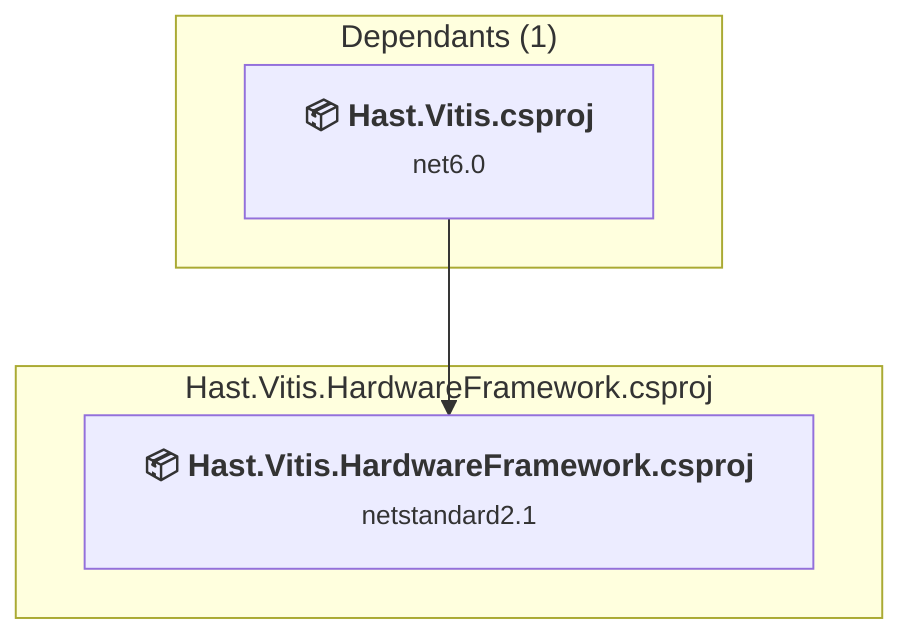

### API Compatibility

| Category | Count | Impact |
| :--- | :---: | :--- |
| 🔴 Binary Incompatible | 0 | High - Require code changes |
| 🟡 Source Incompatible | 0 | Medium - Needs re-compilation and potential conflicting API error fixing |
| 🔵 Behavioral change | 0 | Low - Behavioral changes that may require testing at runtime |
| ✅ Compatible | 0 |  |
| ***Total APIs Analyzed*** | ***0*** |  |

<a id="srchastlayerhastalgorithmshastalgorithmscsproj"></a>
### src\Hastlayer\Hast.Algorithms\Hast.Algorithms.csproj

#### Project Info

- **Current Target Framework:** net6.0
- **Proposed Target Framework:** net10.0
- **SDK-style**: True
- **Project Kind:** ClassLibrary
- **Dependencies**: 0
- **Dependants**: 3
- **Number of Files**: 5
- **Number of Files with Incidents**: 1
- **Lines of Code**: 663
- **Estimated LOC to modify**: 0+ (at least 0,0% of the project)

#### Dependency Graph

Legend:
📦 SDK-style project
⚙️ Classic project

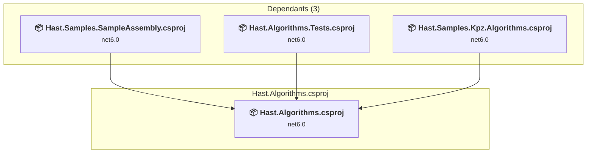

### API Compatibility

| Category | Count | Impact |
| :--- | :---: | :--- |
| 🔴 Binary Incompatible | 0 | High - Require code changes |
| 🟡 Source Incompatible | 0 | Medium - Needs re-compilation and potential conflicting API error fixing |
| 🔵 Behavioral change | 0 | Low - Behavioral changes that may require testing at runtime |
| ✅ Compatible | 237 |  |
| ***Total APIs Analyzed*** | ***237*** |  |

<a id="srchastlayerhastcatapulthastcatapultcsproj"></a>
### src\Hastlayer\Hast.Catapult\Hast.Catapult.csproj

#### Project Info

- **Current Target Framework:** net6.0
- **Proposed Target Framework:** net10.0
- **SDK-style**: True
- **Project Kind:** ClassLibrary
- **Dependencies**: 4
- **Dependants**: 1
- **Number of Files**: 13
- **Number of Files with Incidents**: 3
- **Lines of Code**: 1483
- **Estimated LOC to modify**: 3+ (at least 0,2% of the project)

#### Dependency Graph

Legend:
📦 SDK-style project
⚙️ Classic project

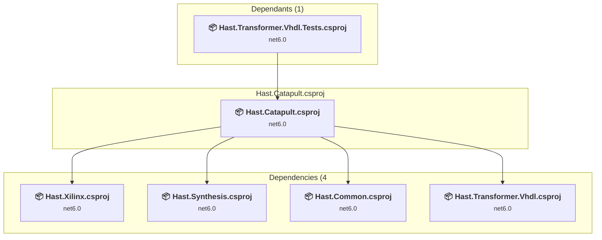

### API Compatibility

| Category | Count | Impact |
| :--- | :---: | :--- |
| 🔴 Binary Incompatible | 0 | High - Require code changes |
| 🟡 Source Incompatible | 3 | Medium - Needs re-compilation and potential conflicting API error fixing |
| 🔵 Behavioral change | 0 | Low - Behavioral changes that may require testing at runtime |
| ✅ Compatible | 801 |  |
| ***Total APIs Analyzed*** | ***804*** |  |

<a id="srchastlayerhastcommonhastcommoncsproj"></a>
### src\Hastlayer\Hast.Common\Hast.Common.csproj

#### Project Info

- **Current Target Framework:** net6.0
- **Proposed Target Framework:** net10.0
- **SDK-style**: True
- **Project Kind:** ClassLibrary
- **Dependencies**: 1
- **Dependants**: 4
- **Number of Files**: 46
- **Number of Files with Incidents**: 2
- **Lines of Code**: 1835
- **Estimated LOC to modify**: 1+ (at least 0,1% of the project)

#### Dependency Graph

Legend:
📦 SDK-style project
⚙️ Classic project

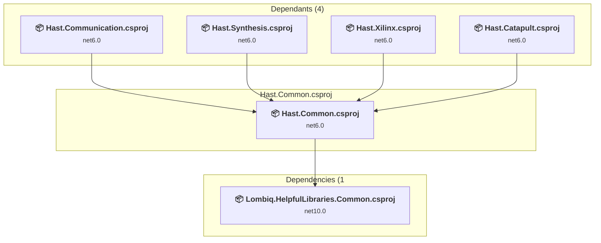

### API Compatibility

| Category | Count | Impact |
| :--- | :---: | :--- |
| 🔴 Binary Incompatible | 0 | High - Require code changes |
| 🟡 Source Incompatible | 0 | Medium - Needs re-compilation and potential conflicting API error fixing |
| 🔵 Behavioral change | 1 | Low - Behavioral changes that may require testing at runtime |
| ✅ Compatible | 1154 |  |
| ***Total APIs Analyzed*** | ***1155*** |  |

<a id="srchastlayerhastcommunicationtesterhastcommunicationtestercsproj"></a>
### src\Hastlayer\Hast.Communication.Tester\Hast.Communication.Tester.csproj

#### Project Info

- **Current Target Framework:** net6.0
- **Proposed Target Framework:** net10.0
- **SDK-style**: True
- **Project Kind:** DotNetCoreApp
- **Dependencies**: 3
- **Dependants**: 0
- **Number of Files**: 7
- **Number of Files with Incidents**: 1
- **Lines of Code**: 603
- **Estimated LOC to modify**: 0+ (at least 0,0% of the project)

#### Dependency Graph

Legend:
📦 SDK-style project
⚙️ Classic project

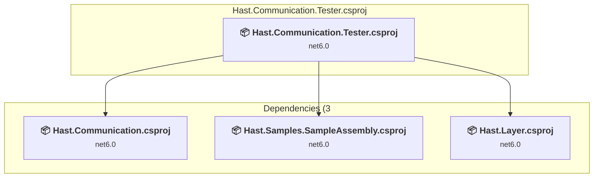

### API Compatibility

| Category | Count | Impact |
| :--- | :---: | :--- |
| 🔴 Binary Incompatible | 0 | High - Require code changes |
| 🟡 Source Incompatible | 0 | Medium - Needs re-compilation and potential conflicting API error fixing |
| 🔵 Behavioral change | 0 | Low - Behavioral changes that may require testing at runtime |
| ✅ Compatible | 458 |  |
| ***Total APIs Analyzed*** | ***458*** |  |

<a id="srchastlayerhastcommunicationhastcommunicationcsproj"></a>
### src\Hastlayer\Hast.Communication\Hast.Communication.csproj

#### Project Info

- **Current Target Framework:** net6.0
- **Proposed Target Framework:** net10.0
- **SDK-style**: True
- **Project Kind:** ClassLibrary
- **Dependencies**: 2
- **Dependants**: 3
- **Number of Files**: 48
- **Number of Files with Incidents**: 7
- **Lines of Code**: 2218
- **Estimated LOC to modify**: 53+ (at least 2,4% of the project)

#### Dependency Graph

Legend:
📦 SDK-style project
⚙️ Classic project

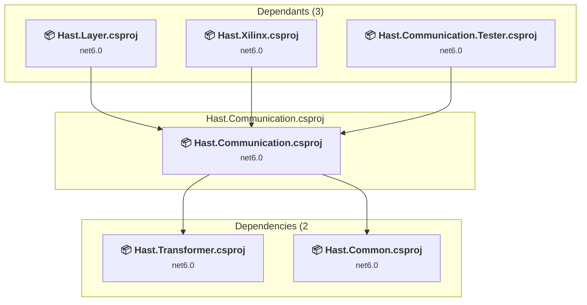

### API Compatibility

| Category | Count | Impact |
| :--- | :---: | :--- |
| 🔴 Binary Incompatible | 0 | High - Require code changes |
| 🟡 Source Incompatible | 53 | Medium - Needs re-compilation and potential conflicting API error fixing |
| 🔵 Behavioral change | 0 | Low - Behavioral changes that may require testing at runtime |
| ✅ Compatible | 1225 |  |
| ***Total APIs Analyzed*** | ***1278*** |  |

<a id="srchastlayerhastconsolehastconsolecsproj"></a>
### src\Hastlayer\Hast.Console\Hast.Console.csproj

#### Project Info

- **Current Target Framework:** net6.0
- **Proposed Target Framework:** net10.0
- **SDK-style**: True
- **Project Kind:** DotNetCoreApp
- **Dependencies**: 1
- **Dependants**: 0
- **Number of Files**: 7
- **Number of Files with Incidents**: 1
- **Lines of Code**: 327
- **Estimated LOC to modify**: 0+ (at least 0,0% of the project)

#### Dependency Graph

Legend:
📦 SDK-style project
⚙️ Classic project

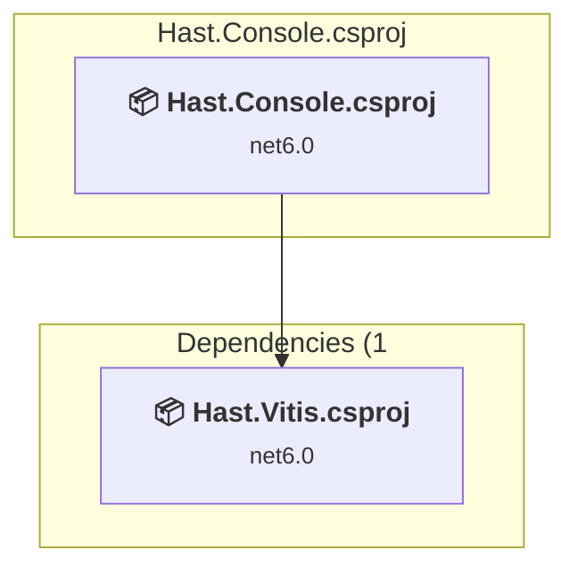

### API Compatibility

| Category | Count | Impact |
| :--- | :---: | :--- |
| 🔴 Binary Incompatible | 0 | High - Require code changes |
| 🟡 Source Incompatible | 0 | Medium - Needs re-compilation and potential conflicting API error fixing |
| 🔵 Behavioral change | 0 | Low - Behavioral changes that may require testing at runtime |
| ✅ Compatible | 309 |  |
| ***Total APIs Analyzed*** | ***309*** |  |

<a id="srchastlayerhastlayerhastlayercsproj"></a>
### src\Hastlayer\Hast.Layer\Hast.Layer.csproj

#### Project Info

- **Current Target Framework:** net6.0
- **Proposed Target Framework:** net10.0
- **SDK-style**: True
- **Project Kind:** ClassLibrary
- **Dependencies**: 7
- **Dependants**: 8
- **Number of Files**: 12
- **Number of Files with Incidents**: 2
- **Lines of Code**: 842
- **Estimated LOC to modify**: 2+ (at least 0,2% of the project)

#### Dependency Graph

Legend:
📦 SDK-style project
⚙️ Classic project

```mermaid
flowchart TB
    subgraph upstream["Dependants (8)"]
        P1["<b>📦&nbsp;Hast.Samples.Consumer.csproj</b><br/><small>net6.0</small>"]
        P5["<b>📦&nbsp;Hast.Samples.SampleAssembly.csproj</b><br/><small>net6.0</small>"]
        P17["<b>📦&nbsp;Hast.Samples.Demo.csproj</b><br/><small>net6.0</small>"]
        P23["<b>📦&nbsp;Hast.Communication.Tester.csproj</b><br/><small>net6.0</small>"]
        P24["<b>📦&nbsp;Hast.Samples.Kpz.Algorithms.csproj</b><br/><small>net6.0</small>"]
        P25["<b>📦&nbsp;Hast.Samples.FSharpSampleAssembly.fsproj</b><br/><small>net6.0</small>"]
        P26["<b>📦&nbsp;Hast.TestBase.csproj</b><br/><small>net6.0</small>"]
        P29["<b>📦&nbsp;Hast.TestInputs.Dynamic.csproj</b><br/><small>net6.0</small>"]
        click P1 "#srcsampleshastsamplesconsumerhastsamplesconsumercsproj"
        click P5 "#srcsampleshastsamplessampleassemblyhastsamplessampleassemblycsproj"
        click P17 "#srcsampleshastsamplesdemohastsamplesdemocsproj"
        click P23 "#srchastlayerhastcommunicationtesterhastcommunicationtestercsproj"
        click P24 "#srcsampleshastsampleskpzalgorithmshastsampleskpzalgorithmscsproj"
        click P25 "#srcsampleshastsamplesfsharpsampleassemblyhastsamplesfsharpsampleassemblyfsproj"
        click P26 "#testhasttestbasehasttestbasecsproj"
        click P29 "#testtestinputassemblieshasttestinputsdynamichasttestinputsdynamiccsproj"
    end
    subgraph current["Hast.Layer.csproj"]
        MAIN["<b>📦&nbsp;Hast.Layer.csproj</b><br/><small>net6.0</small>"]
        click MAIN "#srchastlayerhastlayerhastlayercsproj"
    end
    subgraph downstream["Dependencies (7"]
        P8["<b>📦&nbsp;Hast.Communication.csproj</b><br/><small>net6.0</small>"]
        P10["<b>📦&nbsp;Hast.Xilinx.csproj</b><br/><small>net6.0</small>"]
        P9["<b>📦&nbsp;Hast.Synthesis.csproj</b><br/><small>net6.0</small>"]
        P4["<b>📦&nbsp;Hast.VhdlBuilder.csproj</b><br/><small>net6.0</small>"]
        P3["<b>📦&nbsp;Hast.Transformer.csproj</b><br/><small>net6.0</small>"]
        P35["<b>📦&nbsp;Hast.Vitis.csproj</b><br/><small>net6.0</small>"]
        P11["<b>📦&nbsp;Hast.Transformer.Vhdl.csproj</b><br/><small>net6.0</small>"]
        click P8 "#srchastlayerhastcommunicationhastcommunicationcsproj"
        click P10 "#srchastlayerhastxilinxhastxilinxcsproj"
        click P9 "#srchastlayerhastsynthesishastsynthesiscsproj"
        click P4 "#srchastlayerhastvhdlbuilderhastvhdlbuildercsproj"
        click P3 "#srchastlayerhasttransformerhasttransformercsproj"
        click P35 "#srchastlayerhastvitishastvitiscsproj"
        click P11 "#srchastlayerhasttransformervhdlhasttransformervhdlcsproj"
    end
    P1 --> MAIN
    P5 --> MAIN
    P17 --> MAIN
    P23 --> MAIN
    P24 --> MAIN
    P25 --> MAIN
    P26 --> MAIN
    P29 --> MAIN
    MAIN --> P8
    MAIN --> P10
    MAIN --> P9
    MAIN --> P4
    MAIN --> P3
    MAIN --> P35
    MAIN --> P11

```

### API Compatibility

| Category | Count | Impact |
| :--- | :---: | :--- |
| 🔴 Binary Incompatible | 0 | High - Require code changes |
| 🟡 Source Incompatible | 2 | Medium - Needs re-compilation and potential conflicting API error fixing |
| 🔵 Behavioral change | 0 | Low - Behavioral changes that may require testing at runtime |
| ✅ Compatible | 551 |  |
| ***Total APIs Analyzed*** | ***553*** |  |

<a id="srchastlayerhastsynthesishastsynthesiscsproj"></a>
### src\Hastlayer\Hast.Synthesis\Hast.Synthesis.csproj

#### Project Info

- **Current Target Framework:** net6.0
- **Proposed Target Framework:** net10.0
- **SDK-style**: True
- **Project Kind:** ClassLibrary
- **Dependencies**: 1
- **Dependants**: 6
- **Number of Files**: 25
- **Number of Files with Incidents**: 1
- **Lines of Code**: 1144
- **Estimated LOC to modify**: 0+ (at least 0,0% of the project)

#### Dependency Graph

Legend:
📦 SDK-style project
⚙️ Classic project

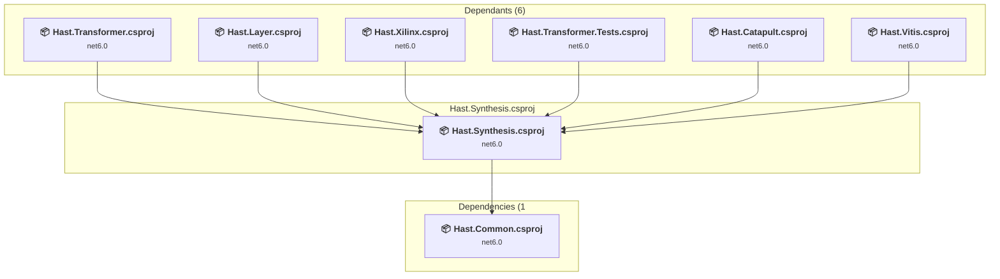

### API Compatibility

| Category | Count | Impact |
| :--- | :---: | :--- |
| 🔴 Binary Incompatible | 0 | High - Require code changes |
| 🟡 Source Incompatible | 0 | Medium - Needs re-compilation and potential conflicting API error fixing |
| 🔵 Behavioral change | 0 | Low - Behavioral changes that may require testing at runtime |
| ✅ Compatible | 669 |  |
| ***Total APIs Analyzed*** | ***669*** |  |

<a id="srchastlayerhasttransformervhdlhasttransformervhdlcsproj"></a>
### src\Hastlayer\Hast.Transformer.Vhdl\Hast.Transformer.Vhdl.csproj

#### Project Info

- **Current Target Framework:** net6.0
- **Proposed Target Framework:** net10.0
- **SDK-style**: True
- **Project Kind:** ClassLibrary
- **Dependencies**: 2
- **Dependants**: 3
- **Number of Files**: 108
- **Number of Files with Incidents**: 1
- **Lines of Code**: 8700
- **Estimated LOC to modify**: 0+ (at least 0,0% of the project)

#### Dependency Graph

Legend:
📦 SDK-style project
⚙️ Classic project

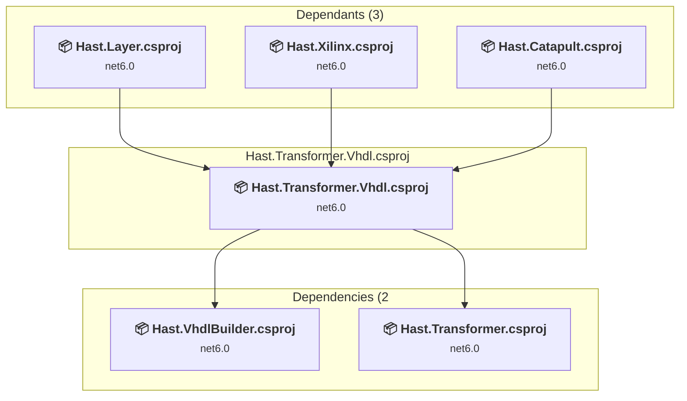

### API Compatibility

| Category | Count | Impact |
| :--- | :---: | :--- |
| 🔴 Binary Incompatible | 0 | High - Require code changes |
| 🟡 Source Incompatible | 0 | Medium - Needs re-compilation and potential conflicting API error fixing |
| 🔵 Behavioral change | 0 | Low - Behavioral changes that may require testing at runtime |
| ✅ Compatible | 3120 |  |
| ***Total APIs Analyzed*** | ***3120*** |  |

<a id="srchastlayerhasttransformerhasttransformercsproj"></a>
### src\Hastlayer\Hast.Transformer\Hast.Transformer.csproj

#### Project Info

- **Current Target Framework:** net6.0
- **Proposed Target Framework:** net10.0
- **SDK-style**: True
- **Project Kind:** ClassLibrary
- **Dependencies**: 1
- **Dependants**: 4
- **Number of Files**: 100
- **Number of Files with Incidents**: 3
- **Lines of Code**: 8115
- **Estimated LOC to modify**: 20+ (at least 0,2% of the project)

#### Dependency Graph

Legend:
📦 SDK-style project
⚙️ Classic project

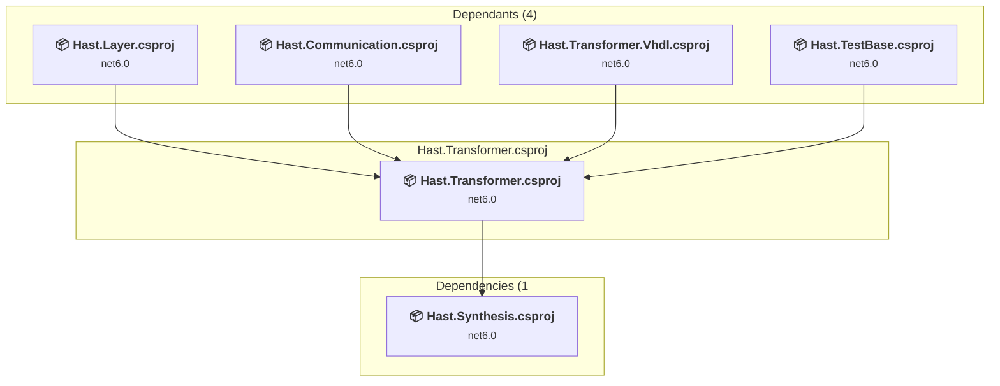

### API Compatibility

| Category | Count | Impact |
| :--- | :---: | :--- |
| 🔴 Binary Incompatible | 0 | High - Require code changes |
| 🟡 Source Incompatible | 20 | Medium - Needs re-compilation and potential conflicting API error fixing |
| 🔵 Behavioral change | 0 | Low - Behavioral changes that may require testing at runtime |
| ✅ Compatible | 3638 |  |
| ***Total APIs Analyzed*** | ***3658*** |  |

#### Project Technologies and Features

| Technology | Issues | Percentage | Migration Path |
| :--- | :---: | :---: | :--- |
| CodeDom & Dynamic Code Generation | 17 | 85,0% | Runtime code generation, compilation, and scripting APIs including CodeDom and JScript that have limited support in .NET Core/.NET. These were used for dynamic code generation but are largely obsolete. Consider Roslyn APIs for code generation or alternative scripting solutions. |

<a id="srchastlayerhastvhdlbuilderhastvhdlbuildercsproj"></a>
### src\Hastlayer\Hast.VhdlBuilder\Hast.VhdlBuilder.csproj

#### Project Info

- **Current Target Framework:** net6.0
- **Proposed Target Framework:** net10.0
- **SDK-style**: True
- **Project Kind:** ClassLibrary
- **Dependencies**: 1
- **Dependants**: 2
- **Number of Files**: 89
- **Number of Files with Incidents**: 2
- **Lines of Code**: 2871
- **Estimated LOC to modify**: 2+ (at least 0,1% of the project)

#### Dependency Graph

Legend:
📦 SDK-style project
⚙️ Classic project

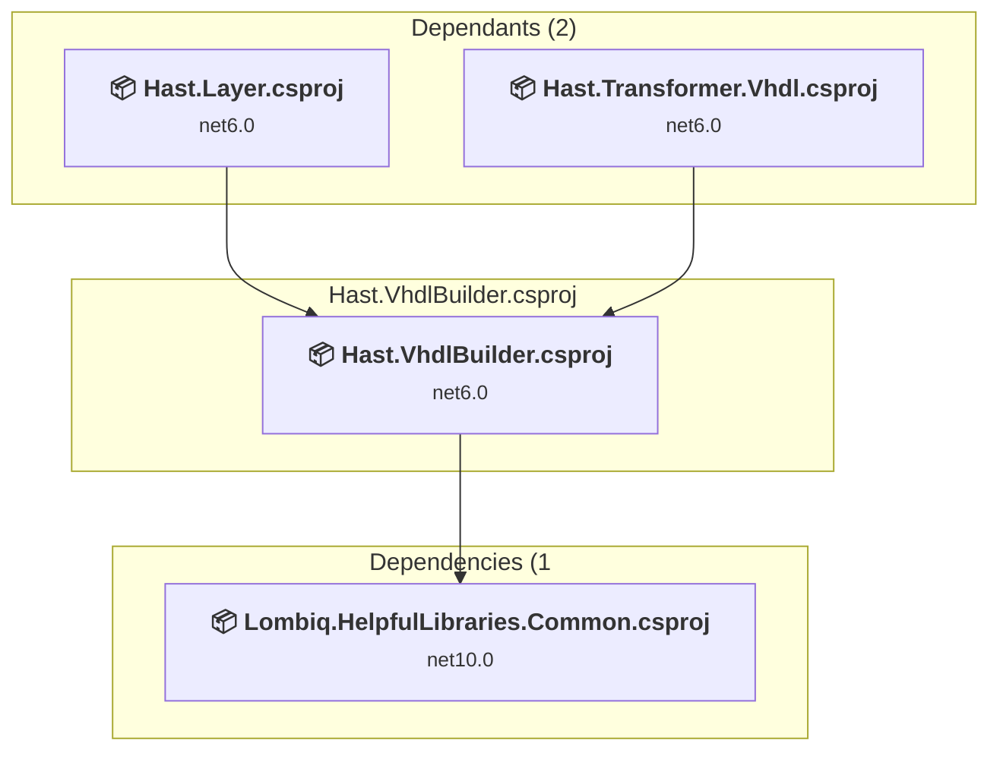

### API Compatibility

| Category | Count | Impact |
| :--- | :---: | :--- |
| 🔴 Binary Incompatible | 0 | High - Require code changes |
| 🟡 Source Incompatible | 2 | Medium - Needs re-compilation and potential conflicting API error fixing |
| 🔵 Behavioral change | 0 | Low - Behavioral changes that may require testing at runtime |
| ✅ Compatible | 1918 |  |
| ***Total APIs Analyzed*** | ***1920*** |  |

<a id="srchastlayerhastvitishastvitiscsproj"></a>
### src\Hastlayer\Hast.Vitis\Hast.Vitis.csproj

#### Project Info

- **Current Target Framework:** net6.0
- **Proposed Target Framework:** net10.0
- **SDK-style**: True
- **Project Kind:** ClassLibrary
- **Dependencies**: 4
- **Dependants**: 3
- **Number of Files**: 36
- **Number of Files with Incidents**: 6
- **Lines of Code**: 3433
- **Estimated LOC to modify**: 26+ (at least 0,8% of the project)

#### Dependency Graph

Legend:
📦 SDK-style project
⚙️ Classic project

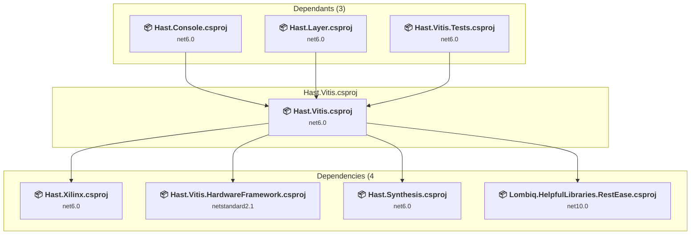

### API Compatibility

| Category | Count | Impact |
| :--- | :---: | :--- |
| 🔴 Binary Incompatible | 0 | High - Require code changes |
| 🟡 Source Incompatible | 1 | Medium - Needs re-compilation and potential conflicting API error fixing |
| 🔵 Behavioral change | 25 | Low - Behavioral changes that may require testing at runtime |
| ✅ Compatible | 2036 |  |
| ***Total APIs Analyzed*** | ***2062*** |  |

<a id="srchastlayerhastxilinxhastxilinxcsproj"></a>
### src\Hastlayer\Hast.Xilinx\Hast.Xilinx.csproj

#### Project Info

- **Current Target Framework:** net6.0
- **Proposed Target Framework:** net10.0
- **SDK-style**: True
- **Project Kind:** ClassLibrary
- **Dependencies**: 4
- **Dependants**: 4
- **Number of Files**: 30
- **Number of Files with Incidents**: 2
- **Lines of Code**: 572
- **Estimated LOC to modify**: 2+ (at least 0,3% of the project)

#### Dependency Graph

Legend:
📦 SDK-style project
⚙️ Classic project

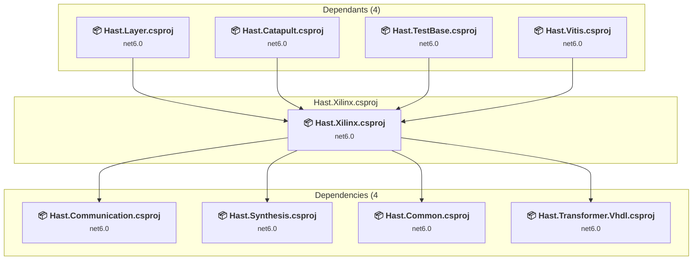

### API Compatibility

| Category | Count | Impact |
| :--- | :---: | :--- |
| 🔴 Binary Incompatible | 0 | High - Require code changes |
| 🟡 Source Incompatible | 2 | Medium - Needs re-compilation and potential conflicting API error fixing |
| 🔵 Behavioral change | 0 | Low - Behavioral changes that may require testing at runtime |
| ✅ Compatible | 271 |  |
| ***Total APIs Analyzed*** | ***273*** |  |

<a id="srclibrariesexternallombiqarithmeticslombiqarithmeticscsproj"></a>
### src\Libraries\External\Lombiq.Arithmetics\Lombiq.Arithmetics.csproj

#### Project Info

- **Current Target Framework:** netstandard2.0✅
- **SDK-style**: True
- **Project Kind:** ClassLibrary
- **Dependencies**: 0
- **Dependants**: 2
- **Number of Files**: 10
- **Number of Files with Incidents**: 2
- **Lines of Code**: 3412
- **Estimated LOC to modify**: 2+ (at least 0,1% of the project)

#### Dependency Graph

Legend:
📦 SDK-style project
⚙️ Classic project

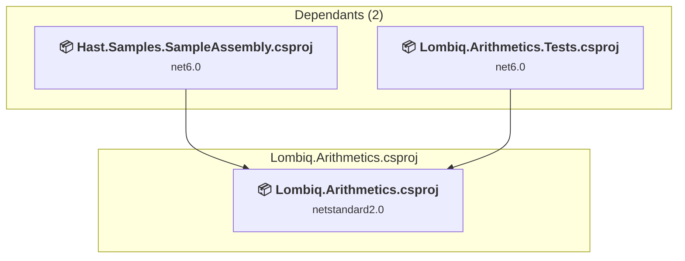

### API Compatibility

| Category | Count | Impact |
| :--- | :---: | :--- |
| 🔴 Binary Incompatible | 0 | High - Require code changes |
| 🟡 Source Incompatible | 2 | Medium - Needs re-compilation and potential conflicting API error fixing |
| 🔵 Behavioral change | 0 | Low - Behavioral changes that may require testing at runtime |
| ✅ Compatible | 1937 |  |
| ***Total APIs Analyzed*** | ***1939*** |  |

<a id="srclibrariesexternallombiqarithmeticslombiqarithmeticstestslombiqarithmeticstestscsproj"></a>
### src\Libraries\External\Lombiq.Arithmetics\Lombiq.Arithmetics.Tests\Lombiq.Arithmetics.Tests.csproj

#### Project Info

- **Current Target Framework:** net6.0
- **Proposed Target Framework:** net10.0
- **SDK-style**: True
- **Project Kind:** ClassLibrary
- **Dependencies**: 1
- **Dependants**: 0
- **Number of Files**: 9
- **Number of Files with Incidents**: 1
- **Lines of Code**: 2093
- **Estimated LOC to modify**: 0+ (at least 0,0% of the project)

#### Dependency Graph

Legend:
📦 SDK-style project
⚙️ Classic project

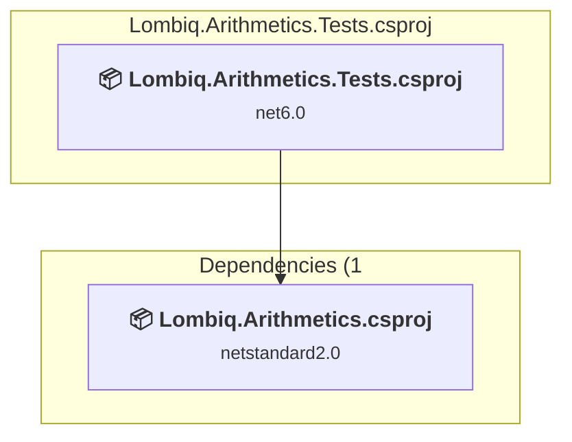

### API Compatibility

| Category | Count | Impact |
| :--- | :---: | :--- |
| 🔴 Binary Incompatible | 0 | High - Require code changes |
| 🟡 Source Incompatible | 0 | Medium - Needs re-compilation and potential conflicting API error fixing |
| 🔵 Behavioral change | 0 | Low - Behavioral changes that may require testing at runtime |
| ✅ Compatible | 1682 |  |
| ***Total APIs Analyzed*** | ***1682*** |  |

<a id="srclibrariesexternallombiqhelpfullibrarieslombiqhelpfullibrariescommonlombiqhelpfullibrariescommoncsproj"></a>
### src\Libraries\External\Lombiq.HelpfulLibraries\Lombiq.HelpfulLibraries.Common\Lombiq.HelpfulLibraries.Common.csproj

#### Project Info

- **Current Target Framework:** net10.0✅
- **SDK-style**: True
- **Project Kind:** DotNetCoreApp
- **Dependencies**: 0
- **Dependants**: 4
- **Number of Files**: 0
- **Lines of Code**: 0
- **Estimated LOC to modify**: 0+ (at least 0,0% of the project)

#### Dependency Graph

Legend:
📦 SDK-style project
⚙️ Classic project

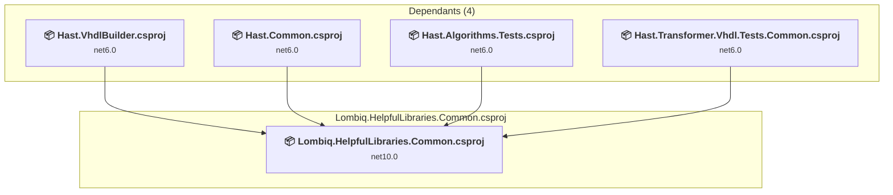

### API Compatibility

| Category | Count | Impact |
| :--- | :---: | :--- |
| 🔴 Binary Incompatible | 0 | High - Require code changes |
| 🟡 Source Incompatible | 0 | Medium - Needs re-compilation and potential conflicting API error fixing |
| 🔵 Behavioral change | 0 | Low - Behavioral changes that may require testing at runtime |
| ✅ Compatible | 0 |  |
| ***Total APIs Analyzed*** | ***0*** |  |

<a id="srclibrariesexternallombiqhelpfullibrarieslombiqhelpfullibrariesresteaselombiqhelpfullibrariesresteasecsproj"></a>
### src\Libraries\External\Lombiq.HelpfulLibraries\Lombiq.HelpfulLibraries.RestEase\Lombiq.HelpfulLibraries.RestEase.csproj

#### Project Info

- **Current Target Framework:** net10.0✅
- **SDK-style**: True
- **Project Kind:** DotNetCoreApp
- **Dependencies**: 0
- **Dependants**: 1
- **Number of Files**: 0
- **Lines of Code**: 0
- **Estimated LOC to modify**: 0+ (at least 0,0% of the project)

#### Dependency Graph

Legend:
📦 SDK-style project
⚙️ Classic project

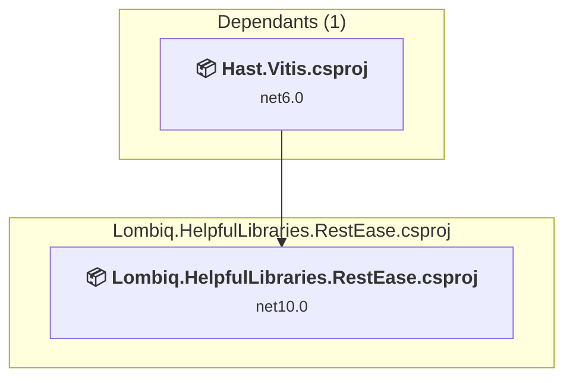

### API Compatibility

| Category | Count | Impact |
| :--- | :---: | :--- |
| 🔴 Binary Incompatible | 0 | High - Require code changes |
| 🟡 Source Incompatible | 0 | Medium - Needs re-compilation and potential conflicting API error fixing |
| 🔵 Behavioral change | 0 | Low - Behavioral changes that may require testing at runtime |
| ✅ Compatible | 0 |  |
| ***Total APIs Analyzed*** | ***0*** |  |

<a id="srcsampleshastsamplesconsumerhastsamplesconsumercsproj"></a>
### src\Samples\Hast.Samples.Consumer\Hast.Samples.Consumer.csproj

#### Project Info

- **Current Target Framework:** net6.0
- **Proposed Target Framework:** net10.0
- **SDK-style**: True
- **Project Kind:** DotNetCoreApp
- **Dependencies**: 3
- **Dependants**: 0
- **Number of Files**: 27
- **Number of Files with Incidents**: 1
- **Lines of Code**: 2012
- **Estimated LOC to modify**: 0+ (at least 0,0% of the project)

#### Dependency Graph

Legend:
📦 SDK-style project
⚙️ Classic project

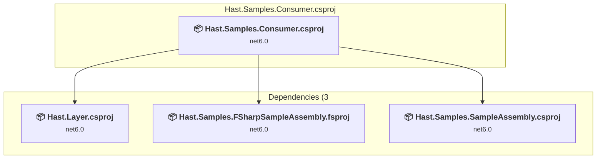

### API Compatibility

| Category | Count | Impact |
| :--- | :---: | :--- |
| 🔴 Binary Incompatible | 0 | High - Require code changes |
| 🟡 Source Incompatible | 0 | Medium - Needs re-compilation and potential conflicting API error fixing |
| 🔵 Behavioral change | 0 | Low - Behavioral changes that may require testing at runtime |
| ✅ Compatible | 1456 |  |
| ***Total APIs Analyzed*** | ***1456*** |  |

<a id="srcsampleshastsamplesdemohastsamplesdemocsproj"></a>
### src\Samples\Hast.Samples.Demo\Hast.Samples.Demo.csproj

#### Project Info

- **Current Target Framework:** net6.0
- **Proposed Target Framework:** net10.0
- **SDK-style**: True
- **Project Kind:** DotNetCoreApp
- **Dependencies**: 2
- **Dependants**: 0
- **Number of Files**: 2
- **Number of Files with Incidents**: 1
- **Lines of Code**: 82
- **Estimated LOC to modify**: 0+ (at least 0,0% of the project)

#### Dependency Graph

Legend:
📦 SDK-style project
⚙️ Classic project

```mermaid
flowchart TB
    subgraph current["Hast.Samples.Demo.csproj"]
        MAIN["<b>📦&nbsp;Hast.Samples.Demo.csproj</b><br/><small>net6.0</small>"]
        click MAIN "#srcsampleshastsamplesdemohastsamplesdemocsproj"
    end
    subgraph downstream["Dependencies (2"]
        P6["<b>📦&nbsp;Hast.Layer.csproj</b><br/><small>net6.0</small>"]
        P5["<b>📦&nbsp;Hast.Samples.SampleAssembly.csproj</b><br/><small>net6.0</small>"]
        click P6 "#srchastlayerhastlayerhastlayercsproj"
        click P5 "#srcsampleshastsamplessampleassemblyhastsamplessampleassemblycsproj"
    end
    MAIN --> P6
    MAIN --> P5

```

### API Compatibility

| Category | Count | Impact |
| :--- | :---: | :--- |
| 🔴 Binary Incompatible | 0 | High - Require code changes |
| 🟡 Source Incompatible | 0 | Medium - Needs re-compilation and potential conflicting API error fixing |
| 🔵 Behavioral change | 0 | Low - Behavioral changes that may require testing at runtime |
| ✅ Compatible | 25 |  |
| ***Total APIs Analyzed*** | ***25*** |  |

<a id="srcsampleshastsamplesfsharpsampleassemblyhastsamplesfsharpsampleassemblyfsproj"></a>
### src\Samples\Hast.Samples.FSharpSampleAssembly\Hast.Samples.FSharpSampleAssembly.fsproj

#### Project Info

- **Current Target Framework:** net6.0
- **Proposed Target Framework:** net10.0
- **SDK-style**: True
- **Project Kind:** ClassLibrary
- **Dependencies**: 1
- **Dependants**: 2
- **Number of Files**: 1
- **Number of Files with Incidents**: 1
- **Lines of Code**: 66
- **Estimated LOC to modify**: 0+ (at least 0,0% of the project)

#### Dependency Graph

Legend:
📦 SDK-style project
⚙️ Classic project

```mermaid
flowchart TB
    subgraph upstream["Dependants (2)"]
        P1["<b>📦&nbsp;Hast.Samples.Consumer.csproj</b><br/><small>net6.0</small>"]
        P12["<b>📦&nbsp;Hast.Transformer.Vhdl.Tests.csproj</b><br/><small>net6.0</small>"]
        click P1 "#srcsampleshastsamplesconsumerhastsamplesconsumercsproj"
        click P12 "#testhasttransformervhdltestshasttransformervhdltestscsproj"
    end
    subgraph current["Hast.Samples.FSharpSampleAssembly.fsproj"]
        MAIN["<b>📦&nbsp;Hast.Samples.FSharpSampleAssembly.fsproj</b><br/><small>net6.0</small>"]
        click MAIN "#srcsampleshastsamplesfsharpsampleassemblyhastsamplesfsharpsampleassemblyfsproj"
    end
    subgraph downstream["Dependencies (1"]
        P6["<b>📦&nbsp;Hast.Layer.csproj</b><br/><small>net6.0</small>"]
        click P6 "#srchastlayerhastlayerhastlayercsproj"
    end
    P1 --> MAIN
    P12 --> MAIN
    MAIN --> P6

```

### API Compatibility

| Category | Count | Impact |
| :--- | :---: | :--- |
| 🔴 Binary Incompatible | 0 | High - Require code changes |
| 🟡 Source Incompatible | 0 | Medium - Needs re-compilation and potential conflicting API error fixing |
| 🔵 Behavioral change | 0 | Low - Behavioral changes that may require testing at runtime |
| ✅ Compatible | 0 |  |
| ***Total APIs Analyzed*** | ***0*** |  |

<a id="srcsampleshastsampleskpzalgorithmshastsampleskpzalgorithmscsproj"></a>
### src\Samples\Hast.Samples.Kpz.Algorithms\Hast.Samples.Kpz.Algorithms.csproj

#### Project Info

- **Current Target Framework:** net6.0
- **Proposed Target Framework:** net10.0
- **SDK-style**: True
- **Project Kind:** ClassLibrary
- **Dependencies**: 2
- **Dependants**: 1
- **Number of Files**: 5
- **Number of Files with Incidents**: 1
- **Lines of Code**: 927
- **Estimated LOC to modify**: 0+ (at least 0,0% of the project)

#### Dependency Graph

Legend:
📦 SDK-style project
⚙️ Classic project

```mermaid
flowchart TB
    subgraph upstream["Dependants (1)"]
        P12["<b>📦&nbsp;Hast.Transformer.Vhdl.Tests.csproj</b><br/><small>net6.0</small>"]
        click P12 "#testhasttransformervhdltestshasttransformervhdltestscsproj"
    end
    subgraph current["Hast.Samples.Kpz.Algorithms.csproj"]
        MAIN["<b>📦&nbsp;Hast.Samples.Kpz.Algorithms.csproj</b><br/><small>net6.0</small>"]
        click MAIN "#srcsampleshastsampleskpzalgorithmshastsampleskpzalgorithmscsproj"
    end
    subgraph downstream["Dependencies (2"]
        P6["<b>📦&nbsp;Hast.Layer.csproj</b><br/><small>net6.0</small>"]
        P19["<b>📦&nbsp;Hast.Algorithms.csproj</b><br/><small>net6.0</small>"]
        click P6 "#srchastlayerhastlayerhastlayercsproj"
        click P19 "#srchastlayerhastalgorithmshastalgorithmscsproj"
    end
    P12 --> MAIN
    MAIN --> P6
    MAIN --> P19

```

### API Compatibility

| Category | Count | Impact |
| :--- | :---: | :--- |
| 🔴 Binary Incompatible | 0 | High - Require code changes |
| 🟡 Source Incompatible | 0 | Medium - Needs re-compilation and potential conflicting API error fixing |
| 🔵 Behavioral change | 0 | Low - Behavioral changes that may require testing at runtime |
| ✅ Compatible | 279 |  |
| ***Total APIs Analyzed*** | ***279*** |  |

<a id="srcsampleshastsamplessampleassemblyhastsamplessampleassemblycsproj"></a>
### src\Samples\Hast.Samples.SampleAssembly\Hast.Samples.SampleAssembly.csproj

#### Project Info

- **Current Target Framework:** net6.0
- **Proposed Target Framework:** net10.0
- **SDK-style**: True
- **Project Kind:** ClassLibrary
- **Dependencies**: 3
- **Dependants**: 4
- **Number of Files**: 31
- **Number of Files with Incidents**: 1
- **Lines of Code**: 4393
- **Estimated LOC to modify**: 0+ (at least 0,0% of the project)

#### Dependency Graph

Legend:
📦 SDK-style project
⚙️ Classic project

```mermaid
flowchart TB
    subgraph upstream["Dependants (4)"]
        P1["<b>📦&nbsp;Hast.Samples.Consumer.csproj</b><br/><small>net6.0</small>"]
        P12["<b>📦&nbsp;Hast.Transformer.Vhdl.Tests.csproj</b><br/><small>net6.0</small>"]
        P17["<b>📦&nbsp;Hast.Samples.Demo.csproj</b><br/><small>net6.0</small>"]
        P23["<b>📦&nbsp;Hast.Communication.Tester.csproj</b><br/><small>net6.0</small>"]
        click P1 "#srcsampleshastsamplesconsumerhastsamplesconsumercsproj"
        click P12 "#testhasttransformervhdltestshasttransformervhdltestscsproj"
        click P17 "#srcsampleshastsamplesdemohastsamplesdemocsproj"
        click P23 "#srchastlayerhastcommunicationtesterhastcommunicationtestercsproj"
    end
    subgraph current["Hast.Samples.SampleAssembly.csproj"]
        MAIN["<b>📦&nbsp;Hast.Samples.SampleAssembly.csproj</b><br/><small>net6.0</small>"]
        click MAIN "#srcsampleshastsamplessampleassemblyhastsamplessampleassemblycsproj"
    end
    subgraph downstream["Dependencies (3"]
        P20["<b>📦&nbsp;Lombiq.Arithmetics.csproj</b><br/><small>netstandard2.0</small>"]
        P6["<b>📦&nbsp;Hast.Layer.csproj</b><br/><small>net6.0</small>"]
        P19["<b>📦&nbsp;Hast.Algorithms.csproj</b><br/><small>net6.0</small>"]
        click P20 "#srclibrariesexternallombiqarithmeticslombiqarithmeticscsproj"
        click P6 "#srchastlayerhastlayerhastlayercsproj"
        click P19 "#srchastlayerhastalgorithmshastalgorithmscsproj"
    end
    P1 --> MAIN
    P12 --> MAIN
    P17 --> MAIN
    P23 --> MAIN
    MAIN --> P20
    MAIN --> P6
    MAIN --> P19

```

### API Compatibility

| Category | Count | Impact |
| :--- | :---: | :--- |
| 🔴 Binary Incompatible | 0 | High - Require code changes |
| 🟡 Source Incompatible | 0 | Medium - Needs re-compilation and potential conflicting API error fixing |
| 🔵 Behavioral change | 0 | Low - Behavioral changes that may require testing at runtime |
| ✅ Compatible | 2318 |  |
| ***Total APIs Analyzed*** | ***2318*** |  |

<a id="testhastalgorithmstestshastalgorithmstestscsproj"></a>
### test\Hast.Algorithms.Tests\Hast.Algorithms.Tests.csproj

#### Project Info

- **Current Target Framework:** net6.0
- **Proposed Target Framework:** net10.0
- **SDK-style**: True
- **Project Kind:** ClassLibrary
- **Dependencies**: 2
- **Dependants**: 0
- **Number of Files**: 1
- **Number of Files with Incidents**: 1
- **Lines of Code**: 473
- **Estimated LOC to modify**: 0+ (at least 0,0% of the project)

#### Dependency Graph

Legend:
📦 SDK-style project
⚙️ Classic project

```mermaid
flowchart TB
    subgraph current["Hast.Algorithms.Tests.csproj"]
        MAIN["<b>📦&nbsp;Hast.Algorithms.Tests.csproj</b><br/><small>net6.0</small>"]
        click MAIN "#testhastalgorithmstestshastalgorithmstestscsproj"
    end
    subgraph downstream["Dependencies (2"]
        P19["<b>📦&nbsp;Hast.Algorithms.csproj</b><br/><small>net6.0</small>"]
        P33["<b>📦&nbsp;Lombiq.HelpfulLibraries.Common.csproj</b><br/><small>net10.0</small>"]
        click P19 "#srchastlayerhastalgorithmshastalgorithmscsproj"
        click P33 "#srclibrariesexternallombiqhelpfullibrarieslombiqhelpfullibrariescommonlombiqhelpfullibrariescommoncsproj"
    end
    MAIN --> P19
    MAIN --> P33

```

### API Compatibility

| Category | Count | Impact |
| :--- | :---: | :--- |
| 🔴 Binary Incompatible | 0 | High - Require code changes |
| 🟡 Source Incompatible | 0 | Medium - Needs re-compilation and potential conflicting API error fixing |
| 🔵 Behavioral change | 0 | Low - Behavioral changes that may require testing at runtime |
| ✅ Compatible | 335 |  |
| ***Total APIs Analyzed*** | ***335*** |  |

<a id="testhastdynamictestshastdynamictestscsproj"></a>
### test\Hast.DynamicTests\Hast.DynamicTests.csproj

#### Project Info

- **Current Target Framework:** net6.0
- **Proposed Target Framework:** net10.0
- **SDK-style**: True
- **Project Kind:** DotNetCoreApp
- **Dependencies**: 2
- **Dependants**: 0
- **Number of Files**: 6
- **Number of Files with Incidents**: 1
- **Lines of Code**: 264
- **Estimated LOC to modify**: 0+ (at least 0,0% of the project)

#### Dependency Graph

Legend:
📦 SDK-style project
⚙️ Classic project

```mermaid
flowchart TB
    subgraph current["Hast.DynamicTests.csproj"]
        MAIN["<b>📦&nbsp;Hast.DynamicTests.csproj</b><br/><small>net6.0</small>"]
        click MAIN "#testhastdynamictestshastdynamictestscsproj"
    end
    subgraph downstream["Dependencies (2"]
        P12["<b>📦&nbsp;Hast.Transformer.Vhdl.Tests.csproj</b><br/><small>net6.0</small>"]
        P29["<b>📦&nbsp;Hast.TestInputs.Dynamic.csproj</b><br/><small>net6.0</small>"]
        click P12 "#testhasttransformervhdltestshasttransformervhdltestscsproj"
        click P29 "#testtestinputassemblieshasttestinputsdynamichasttestinputsdynamiccsproj"
    end
    MAIN --> P12
    MAIN --> P29

```

### API Compatibility

| Category | Count | Impact |
| :--- | :---: | :--- |
| 🔴 Binary Incompatible | 0 | High - Require code changes |
| 🟡 Source Incompatible | 0 | Medium - Needs re-compilation and potential conflicting API error fixing |
| 🔵 Behavioral change | 0 | Low - Behavioral changes that may require testing at runtime |
| ✅ Compatible | 142 |  |
| ***Total APIs Analyzed*** | ***142*** |  |

<a id="testhasttestbasehasttestbasecsproj"></a>
### test\Hast.TestBase\Hast.TestBase.csproj

#### Project Info

- **Current Target Framework:** net6.0
- **Proposed Target Framework:** net10.0
- **SDK-style**: True
- **Project Kind:** ClassLibrary
- **Dependencies**: 5
- **Dependants**: 3
- **Number of Files**: 1
- **Number of Files with Incidents**: 1
- **Lines of Code**: 17
- **Estimated LOC to modify**: 0+ (at least 0,0% of the project)

#### Dependency Graph

Legend:
📦 SDK-style project
⚙️ Classic project

```mermaid
flowchart TB
    subgraph upstream["Dependants (3)"]
        P12["<b>📦&nbsp;Hast.Transformer.Vhdl.Tests.csproj</b><br/><small>net6.0</small>"]
        P13["<b>📦&nbsp;Hast.Transformer.Tests.csproj</b><br/><small>net6.0</small>"]
        P34["<b>📦&nbsp;Hast.Vitis.Tests.csproj</b><br/><small>net6.0</small>"]
        click P12 "#testhasttransformervhdltestshasttransformervhdltestscsproj"
        click P13 "#testhasttransformertestshasttransformertestscsproj"
        click P34 "#testhastvitistestshastvitistestscsproj"
    end
    subgraph current["Hast.TestBase.csproj"]
        MAIN["<b>📦&nbsp;Hast.TestBase.csproj</b><br/><small>net6.0</small>"]
        click MAIN "#testhasttestbasehasttestbasecsproj"
    end
    subgraph downstream["Dependencies (5"]
        P14["<b>📦&nbsp;Hast.TestInputs.ClassStructure1.csproj</b><br/><small>net6.0</small>"]
        P15["<b>📦&nbsp;Hast.TestInputs.ClassStructure2.csproj</b><br/><small>net6.0</small>"]
        P10["<b>📦&nbsp;Hast.Xilinx.csproj</b><br/><small>net6.0</small>"]
        P3["<b>📦&nbsp;Hast.Transformer.csproj</b><br/><small>net6.0</small>"]
        P6["<b>📦&nbsp;Hast.Layer.csproj</b><br/><small>net6.0</small>"]
        click P14 "#testtestinputassembliesclassstructureexampleshasttestinputsclassstructure1hasttestinputsclassstructure1csproj"
        click P15 "#testtestinputassembliesclassstructureexampleshasttestinputsclassstructure2hasttestinputsclassstructure2csproj"
        click P10 "#srchastlayerhastxilinxhastxilinxcsproj"
        click P3 "#srchastlayerhasttransformerhasttransformercsproj"
        click P6 "#srchastlayerhastlayerhastlayercsproj"
    end
    P12 --> MAIN
    P13 --> MAIN
    P34 --> MAIN
    MAIN --> P14
    MAIN --> P15
    MAIN --> P10
    MAIN --> P3
    MAIN --> P6

```

### API Compatibility

| Category | Count | Impact |
| :--- | :---: | :--- |
| 🔴 Binary Incompatible | 0 | High - Require code changes |
| 🟡 Source Incompatible | 0 | Medium - Needs re-compilation and potential conflicting API error fixing |
| 🔵 Behavioral change | 0 | Low - Behavioral changes that may require testing at runtime |
| ✅ Compatible | 17 |  |
| ***Total APIs Analyzed*** | ***17*** |  |

<a id="testhasttransformertestshasttransformertestscsproj"></a>
### test\Hast.Transformer.Tests\Hast.Transformer.Tests.csproj

#### Project Info

- **Current Target Framework:** net6.0
- **Proposed Target Framework:** net10.0
- **SDK-style**: True
- **Project Kind:** ClassLibrary
- **Dependencies**: 2
- **Dependants**: 1
- **Number of Files**: 2
- **Number of Files with Incidents**: 1
- **Lines of Code**: 221
- **Estimated LOC to modify**: 0+ (at least 0,0% of the project)

#### Dependency Graph

Legend:
📦 SDK-style project
⚙️ Classic project

```mermaid
flowchart TB
    subgraph upstream["Dependants (1)"]
        P12["<b>📦&nbsp;Hast.Transformer.Vhdl.Tests.csproj</b><br/><small>net6.0</small>"]
        click P12 "#testhasttransformervhdltestshasttransformervhdltestscsproj"
    end
    subgraph current["Hast.Transformer.Tests.csproj"]
        MAIN["<b>📦&nbsp;Hast.Transformer.Tests.csproj</b><br/><small>net6.0</small>"]
        click MAIN "#testhasttransformertestshasttransformertestscsproj"
    end
    subgraph downstream["Dependencies (2"]
        P9["<b>📦&nbsp;Hast.Synthesis.csproj</b><br/><small>net6.0</small>"]
        P26["<b>📦&nbsp;Hast.TestBase.csproj</b><br/><small>net6.0</small>"]
        click P9 "#srchastlayerhastsynthesishastsynthesiscsproj"
        click P26 "#testhasttestbasehasttestbasecsproj"
    end
    P12 --> MAIN
    MAIN --> P9
    MAIN --> P26

```

### API Compatibility

| Category | Count | Impact |
| :--- | :---: | :--- |
| 🔴 Binary Incompatible | 0 | High - Require code changes |
| 🟡 Source Incompatible | 0 | Medium - Needs re-compilation and potential conflicting API error fixing |
| 🔵 Behavioral change | 0 | Low - Behavioral changes that may require testing at runtime |
| ✅ Compatible | 307 |  |
| ***Total APIs Analyzed*** | ***307*** |  |

<a id="testhasttransformervhdltestscommonhasttransformervhdltestscommoncsproj"></a>
### test\Hast.Transformer.Vhdl.Tests.Common\Hast.Transformer.Vhdl.Tests.Common.csproj

#### Project Info

- **Current Target Framework:** net6.0
- **Proposed Target Framework:** net10.0
- **SDK-style**: True
- **Project Kind:** ClassLibrary
- **Dependencies**: 1
- **Dependants**: 1
- **Number of Files**: 2
- **Number of Files with Incidents**: 1
- **Lines of Code**: 39
- **Estimated LOC to modify**: 0+ (at least 0,0% of the project)

#### Dependency Graph

Legend:
📦 SDK-style project
⚙️ Classic project

```mermaid
flowchart TB
    subgraph upstream["Dependants (1)"]
        P12["<b>📦&nbsp;Hast.Transformer.Vhdl.Tests.csproj</b><br/><small>net6.0</small>"]
        click P12 "#testhasttransformervhdltestshasttransformervhdltestscsproj"
    end
    subgraph current["Hast.Transformer.Vhdl.Tests.Common.csproj"]
        MAIN["<b>📦&nbsp;Hast.Transformer.Vhdl.Tests.Common.csproj</b><br/><small>net6.0</small>"]
        click MAIN "#testhasttransformervhdltestscommonhasttransformervhdltestscommoncsproj"
    end
    subgraph downstream["Dependencies (1"]
        P33["<b>📦&nbsp;Lombiq.HelpfulLibraries.Common.csproj</b><br/><small>net10.0</small>"]
        click P33 "#srclibrariesexternallombiqhelpfullibrarieslombiqhelpfullibrariescommonlombiqhelpfullibrariescommoncsproj"
    end
    P12 --> MAIN
    MAIN --> P33

```

### API Compatibility

| Category | Count | Impact |
| :--- | :---: | :--- |
| 🔴 Binary Incompatible | 0 | High - Require code changes |
| 🟡 Source Incompatible | 0 | Medium - Needs re-compilation and potential conflicting API error fixing |
| 🔵 Behavioral change | 0 | Low - Behavioral changes that may require testing at runtime |
| ✅ Compatible | 19 |  |
| ***Total APIs Analyzed*** | ***19*** |  |

<a id="testhasttransformervhdltestshasttransformervhdltestscsproj"></a>
### test\Hast.Transformer.Vhdl.Tests\Hast.Transformer.Vhdl.Tests.csproj

#### Project Info

- **Current Target Framework:** net6.0
- **Proposed Target Framework:** net10.0
- **SDK-style**: True
- **Project Kind:** ClassLibrary
- **Dependencies**: 10
- **Dependants**: 1
- **Number of Files**: 13
- **Number of Files with Incidents**: 1
- **Lines of Code**: 877
- **Estimated LOC to modify**: 0+ (at least 0,0% of the project)

#### Dependency Graph

Legend:
📦 SDK-style project
⚙️ Classic project

```mermaid
flowchart TB
    subgraph upstream["Dependants (1)"]
        P28["<b>📦&nbsp;Hast.DynamicTests.csproj</b><br/><small>net6.0</small>"]
        click P28 "#testhastdynamictestshastdynamictestscsproj"
    end
    subgraph current["Hast.Transformer.Vhdl.Tests.csproj"]
        MAIN["<b>📦&nbsp;Hast.Transformer.Vhdl.Tests.csproj</b><br/><small>net6.0</small>"]
        click MAIN "#testhasttransformervhdltestshasttransformervhdltestscsproj"
    end
    subgraph downstream["Dependencies (10"]
        P22["<b>📦&nbsp;Hast.Catapult.csproj</b><br/><small>net6.0</small>"]
        P24["<b>📦&nbsp;Hast.Samples.Kpz.Algorithms.csproj</b><br/><small>net6.0</small>"]
        P29["<b>📦&nbsp;Hast.TestInputs.Dynamic.csproj</b><br/><small>net6.0</small>"]
        P25["<b>📦&nbsp;Hast.Samples.FSharpSampleAssembly.fsproj</b><br/><small>net6.0</small>"]
        P13["<b>📦&nbsp;Hast.Transformer.Tests.csproj</b><br/><small>net6.0</small>"]
        P16["<b>📦&nbsp;Hast.TestInputs.Invalid.csproj</b><br/><small>net6.0</small>"]
        P27["<b>📦&nbsp;Hast.TestInputs.Static.csproj</b><br/><small>net6.0</small>"]
        P36["<b>📦&nbsp;Hast.Transformer.Vhdl.Tests.Common.csproj</b><br/><small>net6.0</small>"]
        P26["<b>📦&nbsp;Hast.TestBase.csproj</b><br/><small>net6.0</small>"]
        P5["<b>📦&nbsp;Hast.Samples.SampleAssembly.csproj</b><br/><small>net6.0</small>"]
        click P22 "#srchastlayerhastcatapulthastcatapultcsproj"
        click P24 "#srcsampleshastsampleskpzalgorithmshastsampleskpzalgorithmscsproj"
        click P29 "#testtestinputassemblieshasttestinputsdynamichasttestinputsdynamiccsproj"
        click P25 "#srcsampleshastsamplesfsharpsampleassemblyhastsamplesfsharpsampleassemblyfsproj"
        click P13 "#testhasttransformertestshasttransformertestscsproj"
        click P16 "#testtestinputassemblieshasttestinputsinvalidhasttestinputsinvalidcsproj"
        click P27 "#testtestinputassemblieshasttestinputsstatichasttestinputsstaticcsproj"
        click P36 "#testhasttransformervhdltestscommonhasttransformervhdltestscommoncsproj"
        click P26 "#testhasttestbasehasttestbasecsproj"
        click P5 "#srcsampleshastsamplessampleassemblyhastsamplessampleassemblycsproj"
    end
    P28 --> MAIN
    MAIN --> P22
    MAIN --> P24
    MAIN --> P29
    MAIN --> P25
    MAIN --> P13
    MAIN --> P16
    MAIN --> P27
    MAIN --> P36
    MAIN --> P26
    MAIN --> P5

```

### API Compatibility

| Category | Count | Impact |
| :--- | :---: | :--- |
| 🔴 Binary Incompatible | 0 | High - Require code changes |
| 🟡 Source Incompatible | 0 | Medium - Needs re-compilation and potential conflicting API error fixing |
| 🔵 Behavioral change | 0 | Low - Behavioral changes that may require testing at runtime |
| ✅ Compatible | 385 |  |
| ***Total APIs Analyzed*** | ***385*** |  |

<a id="testhastvitistestshastvitistestscsproj"></a>
### test\Hast.Vitis.Tests\Hast.Vitis.Tests.csproj

#### Project Info

- **Current Target Framework:** net6.0
- **Proposed Target Framework:** net10.0
- **SDK-style**: True
- **Project Kind:** ClassLibrary
- **Dependencies**: 2
- **Dependants**: 0
- **Number of Files**: 1
- **Number of Files with Incidents**: 1
- **Lines of Code**: 173
- **Estimated LOC to modify**: 0+ (at least 0,0% of the project)

#### Dependency Graph

Legend:
📦 SDK-style project
⚙️ Classic project

```mermaid
flowchart TB
    subgraph current["Hast.Vitis.Tests.csproj"]
        MAIN["<b>📦&nbsp;Hast.Vitis.Tests.csproj</b><br/><small>net6.0</small>"]
        click MAIN "#testhastvitistestshastvitistestscsproj"
    end
    subgraph downstream["Dependencies (2"]
        P35["<b>📦&nbsp;Hast.Vitis.csproj</b><br/><small>net6.0</small>"]
        P26["<b>📦&nbsp;Hast.TestBase.csproj</b><br/><small>net6.0</small>"]
        click P35 "#srchastlayerhastvitishastvitiscsproj"
        click P26 "#testhasttestbasehasttestbasecsproj"
    end
    MAIN --> P35
    MAIN --> P26

```

### API Compatibility

| Category | Count | Impact |
| :--- | :---: | :--- |
| 🔴 Binary Incompatible | 0 | High - Require code changes |
| 🟡 Source Incompatible | 0 | Medium - Needs re-compilation and potential conflicting API error fixing |
| 🔵 Behavioral change | 0 | Low - Behavioral changes that may require testing at runtime |
| ✅ Compatible | 35 |  |
| ***Total APIs Analyzed*** | ***35*** |  |

<a id="testtestinputassembliesclassstructureexampleshasttestinputsclassstructure1hasttestinputsclassstructure1csproj"></a>
### test\TestInputAssemblies\ClassStructureExamples\Hast.TestInputs.ClassStructure1\Hast.TestInputs.ClassStructure1.csproj

#### Project Info

- **Current Target Framework:** net6.0
- **Proposed Target Framework:** net10.0
- **SDK-style**: True
- **Project Kind:** ClassLibrary
- **Dependencies**: 1
- **Dependants**: 2
- **Number of Files**: 9
- **Number of Files with Incidents**: 1
- **Lines of Code**: 205
- **Estimated LOC to modify**: 0+ (at least 0,0% of the project)

#### Dependency Graph

Legend:
📦 SDK-style project
⚙️ Classic project

```mermaid
flowchart TB
    subgraph upstream["Dependants (2)"]
        P15["<b>📦&nbsp;Hast.TestInputs.ClassStructure2.csproj</b><br/><small>net6.0</small>"]
        P26["<b>📦&nbsp;Hast.TestBase.csproj</b><br/><small>net6.0</small>"]
        click P15 "#testtestinputassembliesclassstructureexampleshasttestinputsclassstructure2hasttestinputsclassstructure2csproj"
        click P26 "#testhasttestbasehasttestbasecsproj"
    end
    subgraph current["Hast.TestInputs.ClassStructure1.csproj"]
        MAIN["<b>📦&nbsp;Hast.TestInputs.ClassStructure1.csproj</b><br/><small>net6.0</small>"]
        click MAIN "#testtestinputassembliesclassstructureexampleshasttestinputsclassstructure1hasttestinputsclassstructure1csproj"
    end
    subgraph downstream["Dependencies (1"]
        P32["<b>📦&nbsp;Hast.TestInputs.Base.csproj</b><br/><small>netstandard2.1</small>"]
        click P32 "#testtestinputassemblieshasttestinputsbasehasttestinputsbasecsproj"
    end
    P15 --> MAIN
    P26 --> MAIN
    MAIN --> P32

```

### API Compatibility

| Category | Count | Impact |
| :--- | :---: | :--- |
| 🔴 Binary Incompatible | 0 | High - Require code changes |
| 🟡 Source Incompatible | 0 | Medium - Needs re-compilation and potential conflicting API error fixing |
| 🔵 Behavioral change | 0 | Low - Behavioral changes that may require testing at runtime |
| ✅ Compatible | 54 |  |
| ***Total APIs Analyzed*** | ***54*** |  |

<a id="testtestinputassembliesclassstructureexampleshasttestinputsclassstructure2hasttestinputsclassstructure2csproj"></a>
### test\TestInputAssemblies\ClassStructureExamples\Hast.TestInputs.ClassStructure2\Hast.TestInputs.ClassStructure2.csproj

#### Project Info

- **Current Target Framework:** net6.0
- **Proposed Target Framework:** net10.0
- **SDK-style**: True
- **Project Kind:** ClassLibrary
- **Dependencies**: 1
- **Dependants**: 1
- **Number of Files**: 2
- **Number of Files with Incidents**: 1
- **Lines of Code**: 49
- **Estimated LOC to modify**: 0+ (at least 0,0% of the project)

#### Dependency Graph

Legend:
📦 SDK-style project
⚙️ Classic project

```mermaid
flowchart TB
    subgraph upstream["Dependants (1)"]
        P26["<b>📦&nbsp;Hast.TestBase.csproj</b><br/><small>net6.0</small>"]
        click P26 "#testhasttestbasehasttestbasecsproj"
    end
    subgraph current["Hast.TestInputs.ClassStructure2.csproj"]
        MAIN["<b>📦&nbsp;Hast.TestInputs.ClassStructure2.csproj</b><br/><small>net6.0</small>"]
        click MAIN "#testtestinputassembliesclassstructureexampleshasttestinputsclassstructure2hasttestinputsclassstructure2csproj"
    end
    subgraph downstream["Dependencies (1"]
        P14["<b>📦&nbsp;Hast.TestInputs.ClassStructure1.csproj</b><br/><small>net6.0</small>"]
        click P14 "#testtestinputassembliesclassstructureexampleshasttestinputsclassstructure1hasttestinputsclassstructure1csproj"
    end
    P26 --> MAIN
    MAIN --> P14

```

### API Compatibility

| Category | Count | Impact |
| :--- | :---: | :--- |
| 🔴 Binary Incompatible | 0 | High - Require code changes |
| 🟡 Source Incompatible | 0 | Medium - Needs re-compilation and potential conflicting API error fixing |
| 🔵 Behavioral change | 0 | Low - Behavioral changes that may require testing at runtime |
| ✅ Compatible | 2 |  |
| ***Total APIs Analyzed*** | ***2*** |  |

<a id="testtestinputassemblieshasttestinputsbasehasttestinputsbasecsproj"></a>
### test\TestInputAssemblies\Hast.TestInputs.Base\Hast.TestInputs.Base.csproj

#### Project Info

- **Current Target Framework:** netstandard2.1✅
- **SDK-style**: True
- **Project Kind:** ClassLibrary
- **Dependencies**: 0
- **Dependants**: 4
- **Number of Files**: 1
- **Lines of Code**: 10
- **Estimated LOC to modify**: 0+ (at least 0,0% of the project)

#### Dependency Graph

Legend:
📦 SDK-style project
⚙️ Classic project

```mermaid
flowchart TB
    subgraph upstream["Dependants (4)"]
        P14["<b>📦&nbsp;Hast.TestInputs.ClassStructure1.csproj</b><br/><small>net6.0</small>"]
        P16["<b>📦&nbsp;Hast.TestInputs.Invalid.csproj</b><br/><small>net6.0</small>"]
        P27["<b>📦&nbsp;Hast.TestInputs.Static.csproj</b><br/><small>net6.0</small>"]
        P29["<b>📦&nbsp;Hast.TestInputs.Dynamic.csproj</b><br/><small>net6.0</small>"]
        click P14 "#testtestinputassembliesclassstructureexampleshasttestinputsclassstructure1hasttestinputsclassstructure1csproj"
        click P16 "#testtestinputassemblieshasttestinputsinvalidhasttestinputsinvalidcsproj"
        click P27 "#testtestinputassemblieshasttestinputsstatichasttestinputsstaticcsproj"
        click P29 "#testtestinputassemblieshasttestinputsdynamichasttestinputsdynamiccsproj"
    end
    subgraph current["Hast.TestInputs.Base.csproj"]
        MAIN["<b>📦&nbsp;Hast.TestInputs.Base.csproj</b><br/><small>netstandard2.1</small>"]
        click MAIN "#testtestinputassemblieshasttestinputsbasehasttestinputsbasecsproj"
    end
    P14 --> MAIN
    P16 --> MAIN
    P27 --> MAIN
    P29 --> MAIN

```

### API Compatibility

| Category | Count | Impact |
| :--- | :---: | :--- |
| 🔴 Binary Incompatible | 0 | High - Require code changes |
| 🟡 Source Incompatible | 0 | Medium - Needs re-compilation and potential conflicting API error fixing |
| 🔵 Behavioral change | 0 | Low - Behavioral changes that may require testing at runtime |
| ✅ Compatible | 1 |  |
| ***Total APIs Analyzed*** | ***1*** |  |

<a id="testtestinputassemblieshasttestinputsdynamichasttestinputsdynamiccsproj"></a>
### test\TestInputAssemblies\Hast.TestInputs.Dynamic\Hast.TestInputs.Dynamic.csproj

#### Project Info

- **Current Target Framework:** net6.0
- **Proposed Target Framework:** net10.0
- **SDK-style**: True
- **Project Kind:** ClassLibrary
- **Dependencies**: 2
- **Dependants**: 2
- **Number of Files**: 6
- **Number of Files with Incidents**: 1
- **Lines of Code**: 1556
- **Estimated LOC to modify**: 0+ (at least 0,0% of the project)

#### Dependency Graph

Legend:
📦 SDK-style project
⚙️ Classic project

```mermaid
flowchart TB
    subgraph upstream["Dependants (2)"]
        P12["<b>📦&nbsp;Hast.Transformer.Vhdl.Tests.csproj</b><br/><small>net6.0</small>"]
        P28["<b>📦&nbsp;Hast.DynamicTests.csproj</b><br/><small>net6.0</small>"]
        click P12 "#testhasttransformervhdltestshasttransformervhdltestscsproj"
        click P28 "#testhastdynamictestshastdynamictestscsproj"
    end
    subgraph current["Hast.TestInputs.Dynamic.csproj"]
        MAIN["<b>📦&nbsp;Hast.TestInputs.Dynamic.csproj</b><br/><small>net6.0</small>"]
        click MAIN "#testtestinputassemblieshasttestinputsdynamichasttestinputsdynamiccsproj"
    end
    subgraph downstream["Dependencies (2"]
        P6["<b>📦&nbsp;Hast.Layer.csproj</b><br/><small>net6.0</small>"]
        P32["<b>📦&nbsp;Hast.TestInputs.Base.csproj</b><br/><small>netstandard2.1</small>"]
        click P6 "#srchastlayerhastlayerhastlayercsproj"
        click P32 "#testtestinputassemblieshasttestinputsbasehasttestinputsbasecsproj"
    end
    P12 --> MAIN
    P28 --> MAIN
    MAIN --> P6
    MAIN --> P32

```

### API Compatibility

| Category | Count | Impact |
| :--- | :---: | :--- |
| 🔴 Binary Incompatible | 0 | High - Require code changes |
| 🟡 Source Incompatible | 0 | Medium - Needs re-compilation and potential conflicting API error fixing |
| 🔵 Behavioral change | 0 | Low - Behavioral changes that may require testing at runtime |
| ✅ Compatible | 471 |  |
| ***Total APIs Analyzed*** | ***471*** |  |

<a id="testtestinputassemblieshasttestinputsinvalidhasttestinputsinvalidcsproj"></a>
### test\TestInputAssemblies\Hast.TestInputs.Invalid\Hast.TestInputs.Invalid.csproj

#### Project Info

- **Current Target Framework:** net6.0
- **Proposed Target Framework:** net10.0
- **SDK-style**: True
- **Project Kind:** ClassLibrary
- **Dependencies**: 1
- **Dependants**: 1
- **Number of Files**: 7
- **Number of Files with Incidents**: 1
- **Lines of Code**: 205
- **Estimated LOC to modify**: 0+ (at least 0,0% of the project)

#### Dependency Graph

Legend:
📦 SDK-style project
⚙️ Classic project

```mermaid
flowchart TB
    subgraph upstream["Dependants (1)"]
        P12["<b>📦&nbsp;Hast.Transformer.Vhdl.Tests.csproj</b><br/><small>net6.0</small>"]
        click P12 "#testhasttransformervhdltestshasttransformervhdltestscsproj"
    end
    subgraph current["Hast.TestInputs.Invalid.csproj"]
        MAIN["<b>📦&nbsp;Hast.TestInputs.Invalid.csproj</b><br/><small>net6.0</small>"]
        click MAIN "#testtestinputassemblieshasttestinputsinvalidhasttestinputsinvalidcsproj"
    end
    subgraph downstream["Dependencies (1"]
        P32["<b>📦&nbsp;Hast.TestInputs.Base.csproj</b><br/><small>netstandard2.1</small>"]
        click P32 "#testtestinputassemblieshasttestinputsbasehasttestinputsbasecsproj"
    end
    P12 --> MAIN
    MAIN --> P32

```

### API Compatibility

| Category | Count | Impact |
| :--- | :---: | :--- |
| 🔴 Binary Incompatible | 0 | High - Require code changes |
| 🟡 Source Incompatible | 0 | Medium - Needs re-compilation and potential conflicting API error fixing |
| 🔵 Behavioral change | 0 | Low - Behavioral changes that may require testing at runtime |
| ✅ Compatible | 76 |  |
| ***Total APIs Analyzed*** | ***76*** |  |

<a id="testtestinputassemblieshasttestinputsstatichasttestinputsstaticcsproj"></a>
### test\TestInputAssemblies\Hast.TestInputs.Static\Hast.TestInputs.Static.csproj

#### Project Info

- **Current Target Framework:** net6.0
- **Proposed Target Framework:** net10.0
- **SDK-style**: True
- **Project Kind:** ClassLibrary
- **Dependencies**: 1
- **Dependants**: 1
- **Number of Files**: 8
- **Number of Files with Incidents**: 1
- **Lines of Code**: 401
- **Estimated LOC to modify**: 0+ (at least 0,0% of the project)

#### Dependency Graph

Legend:
📦 SDK-style project
⚙️ Classic project

```mermaid
flowchart TB
    subgraph upstream["Dependants (1)"]
        P12["<b>📦&nbsp;Hast.Transformer.Vhdl.Tests.csproj</b><br/><small>net6.0</small>"]
        click P12 "#testhasttransformervhdltestshasttransformervhdltestscsproj"
    end
    subgraph current["Hast.TestInputs.Static.csproj"]
        MAIN["<b>📦&nbsp;Hast.TestInputs.Static.csproj</b><br/><small>net6.0</small>"]
        click MAIN "#testtestinputassemblieshasttestinputsstatichasttestinputsstaticcsproj"
    end
    subgraph downstream["Dependencies (1"]
        P32["<b>📦&nbsp;Hast.TestInputs.Base.csproj</b><br/><small>netstandard2.1</small>"]
        click P32 "#testtestinputassemblieshasttestinputsbasehasttestinputsbasecsproj"
    end
    P12 --> MAIN
    MAIN --> P32

```

### API Compatibility

| Category | Count | Impact |
| :--- | :---: | :--- |
| 🔴 Binary Incompatible | 0 | High - Require code changes |
| 🟡 Source Incompatible | 0 | Medium - Needs re-compilation and potential conflicting API error fixing |
| 🔵 Behavioral change | 0 | Low - Behavioral changes that may require testing at runtime |
| ✅ Compatible | 93 |  |
| ***Total APIs Analyzed*** | ***93*** |  |

