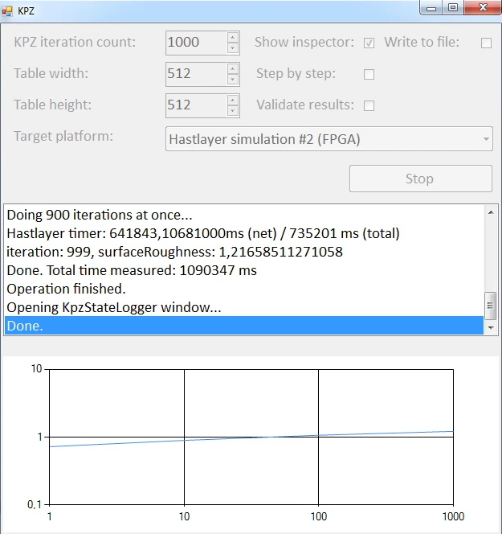

# Hastlayer KPZ algorithm sample


This is an FPGA implementation of the 3D [Kardar-Parisi-Zhang](https://en.wikipedia.org/wiki/Kardar%E2%80%93Parisi%E2%80%93Zhang_equation) surface growth simulation algorithm. Made in collaboration with the [Wigner Research Centre for Physics](http://wigner.mta.hu/en/) to test against an existing GPU implementation (testing is upcoming).


## Related papers

The following paper shows the overall idea behind this project. We implemented a similar system on the FPGA.

Jeffrey Kelling, Géza Ódor, Sibylle Gemming: *Bit-Vectorized GPU Implementation of a Stochastic Cellular Automaton Model for Surface Growth* 

https://arxiv.org/pdf/1606.00310.pdf


## Screenshot




## Brief, informal description of the algorithm

We have a 2D grid, with 2-bit information in each node: derivatives in *x* and *y* directions.

1. We choose a node randomly.

2. We check the *dx* and *dy* values of the node, and also the *dx* of the neighbor at the right, and the *dy* of the neighbor at the bottom.

3. If we find any of the following two patterns, we change them into the other...

```
0 == dx                    /|     |\     1 == dx                 
1 == right neighbor dx    / |-----| \    0 == right neighbor dx  
0 == dy                   \ |-----| /    1 == dy                 
1 == bottom neighbor dy    \|     |/     0 == bottom neighbor dy 
(pyramid pattern)                        (hole pattern)
```

...but we decide based on a random variable. 

Periodic boundary conditions are applied on all edges when looking for these patterns (if we leave the grid on one edge, we reenter on the opposite edge).

We repeat this process N times to complete a single iteration, where N is the number of nodes in the grid.


## Parameters and output

* `probabilityP` is the probability of changing a hole into a pyramid.
* `probabilityQ` is the probability of changing a pyramid into a hole.
* You also need to specify the number of iterations.

Some parameters of the algorithms can only be set in the code, in `KpzKernels.cs` and `KpzKernelsParallelized.cs`.

The output of the algorithm is an *i-S* graph, where *i* is the number of iterations, and *S* is the roughness of the surface (the standard deviation of heights of points on the surface). 

The graph is expected to show a line (on logarithmic axes), unless the size of the grid is very low.


## Implementations 

You can select different implementations of the same algorithm in the GUI:

* The `Original algorithm` is our initial C# implementation for the CPU.
* The `Hastlayer simulation, sequential` is an implementation for the FPGA (which can be simulated on the CPU as well). It stores the whole grid in LUT RAM, thus works only on small grids.
* The `Hastlayer simulation, parallelized` is an implementation for the FPGA (which can be simulated on the CPU as well). It stores the whole grid in the DDR memory of the board, and pulls parts of it into individual execution engines, which work on it in parallel.

