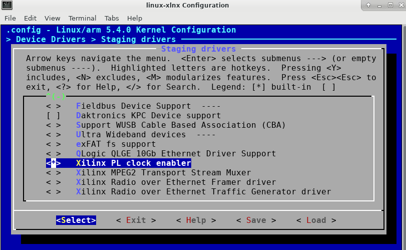

 # Building PetaLinux 2020.2 SD card image for Hastlayer (Trenz TE0715-04-30-1C module)


To be able to run Hastlayer accelerated .NET applications on Trenz Electronics TE0715-04-30-1C Zynq 7030 SOM SoC module you have to build [PetaLinux](https://www.xilinx.com/products/design-tools/embedded-software/petalinux-sdk.html) with certain features enabled. This document describes the required steps.


## Install Xilinx PetaLinux Tools 2020.2

Download PetaLinux 2020.2 installer from [Xilinx website](https://www.xilinx.com/support/download/index.html/content/xilinx/en/downloadNav/embedded-design-tools/2020-2.html):


Building PetaLinux requires a 64-bit Linux machine with supported RedHat 7-8, CentOS 7-8, or Ubuntu 16-18-20. The actual PetaLinux tools installation must be done as a regular user, but you need root access to install additional packages. Note that you will need about 18GB temporary free disk space on the same drive to generate the output files. For more details see [the documentation](https://www.xilinx.com/content/dam/xilinx/support/documentation/sw_manuals/xilinx2021_1/ug1144-petalinux-tools-reference-guide.pdf).

> ℹ️ If you are using the Centos 7 Docker image you don't have a regular root user. Perform the following to create a very regular user called "user" and to install all software dependencies:
> ```shell
> function user-setup() {
>     # Creates non-root user and lets it take over /data.
>     useradd user && passwd user && usermod -G wheel user || return
>     chown user:user /data -R
>     locale-gen en_US.UTF-8 && update-locale
>     echo 'export LANG=en_US.UTF-8' >> /home/user/.bashrc
>      
>     # Installs the necessary dependencies.
>     yum install -y git diffstat unzip texinfo python chrpath wget xterm sdl rpcsvc-proto socat cpio inetutils python2 net-tools tftp-hpa python-virtualenv xorg-server-xvfb bison flex gnupg ncurses autoconf libtool tar gcc sdl sdl2 glib2 screen pax pax-utils libstdc++5 python-django iproute2 lib32-zlib openssl gawk python-pexpect python-pip python-gitpython python-jinja xz iputils python-pylint ncurses-devel gcc-c++ xfce4-terminal
>     
>     # Logs you in as "user".
>     su user
> }
> 
> user-setup
> ```
> 
> If there were no issues this have just logged you in as "user". Next move the installer to your home directory:
> ```shell
> cd
> mv /data/petalinux-*-installer.run ~
> ```

Continue with the PetaLinux installation:

```shell
./petalinux-v2020.2-final-installer.run --dir ~/petalinux20202 --platform "arm"
```

If everything was all right the above command will prompt you with several license viewers. Naturally you carefully read through each navigating with <kbd>PageDown</kbd> and then exiting with <kbd>Q</kbd>.

Before using the PetaLinux tools you first have to set up the environment:

```shell
. ~/petalinux20202/settings.sh
petalinux-util --webtalk off
echo '. ~/petalinux20202/settings.sh' >> ~/.bashrc
echo 'petalinux-util --webtalk off' >> ~/.bashrc
```

> ℹ️ Pay attention to this output, as it will notify you if you are lacking free space, have network connection problems, or missing any dependencies. Don't worry about the not supported OS warning though.


## Configuring and building PetaLinux images

Create a working directory to avoid making a mess. Then create an empty PetaLinux project based on Zynq template and configure the hardware:

```shell
mkdir ~/trenz_te0715_04_30_1c
cd ~/trenz_te0715_04_30_1c
petalinux-create -t project --template zynq --name petalinux
cd petalinux
petalinux-config --silentconfig  --get-hw-description=../vivado/test_board/vivado
```

There is no need to change anything, just press <kbd>ESC</kbd> and save the configuration before exit.

> ⚠️ If you run into an error during this step you can learn more by typing `less build/config.log`.

Configure the kernel:

> ℹ️ If you are a text-mode user (e.g. using Docker or SSH) you will have issues with spawning GUI terminal emulators that the installer expects. You have to tell OpenEmbedded to use [GNU Screen](https://www.gnu.org/software/screen/) as your terminal of choice:
> ```shell
> echo 'OE_TERMINAL = "screen"' >> project-spec/meta-user/conf/petalinuxbsp.conf
> ```

```shell
petalinux-config -c kernel
```

Navigate the menu like this:
* Select _**D**evice Drivers_ and press <kbd>Enter</kbd>.
* Select _**S**taging drivers_.
  * Press <kbd>Space</kbd> to enable the feature.
  * Press <kbd>Enter</kbd>.
* Select _**X**ilinx PL clock enabler_.
  * Press <kbd>Space</kbd> twice so it displays `<*>` next to it.

You can-quick navigate visible elements by pressing the highlighted letter on your keyboard. Press <kbd>ESC</kbd> and save the configuration before exit.



Amend these config files and then configure the root filesystem:

```shell
(
cat <<'EOF'
/include/ "system-conf.dtsi"
/ {
    fclk0: fclk0 {
    status = "okay";
    compatible = "xlnx,fclk";
    clocks = <&clkc 15>;
    };
};

&amba {
  zyxclmm_drm {
    compatible = "xlnx,zocl";
    status = "okay";
  };
};
EOF
) > project-spec/meta-user/recipes-bsp/device-tree/files/system-user.dtsi

echo 'EXTRA_IMAGE_FEATURES = "debug-tweaks"' >> project-spec/meta-user/conf/petalinuxbsp.conf
echo 'IMAGE_AUTOLOGIN = "1"' >> project-spec/meta-user/conf/petalinuxbsp.conf

echo 'CONFIG_opencl-clhpp-dev' >> project-spec/meta-user/conf/user-rootfsconfig
echo 'CONFIG_opencl-headers-dev' >> project-spec/meta-user/conf/user-rootfsconfig
echo 'CONFIG_xrt' >> project-spec/meta-user/conf/user-rootfsconfig
echo 'CONFIG_zocl' >> project-spec/meta-user/conf/user-rootfsconfig

petalinux-config -c rootfs
```

Enter the _user packages_ group and press <kbd>Space</kbd> on each item so the indicators display `[*]` for all of them.
Then press <kbd>ESC</kbd> and save the configuration before exit.


Build the SD card images:

```shell
petalinux-build
petalinux-package --boot --fsbl ./images/linux/zynq_fsbl.elf --fpga ./images/linux/system.bit --u-boot --force
```


## Preparing the SD card

Copy the following three files to the root directory in the first partition on the SD card (it should be less than 32 GB and FAT32 formatted):

```
./images/linux/BOOT.BIN
./images/linux/boot.scr
./images/linux/image.ub
```

> ℹ️ On Docker type `cp -r images/linux/ /data` to move it all into the shared directory.

The _BOOT.BIN_ and the _boot.scr_ contains the [U-Boot](https://www.denx.de/wiki/U-Boot/) and the initial FPGA image. The _image.ub_ contains the kernel and the root file system.

If required you can put additional content on the SD card, and after booting PetaLinux you can access the SD card content in `cd /media/sd-mmcblk0p1/` directory.

To run Hastlayer accelerated .NET applications you should log in as root (the default password is root).


To test the image put the card into the microSD slot on the carrier board. After switching on the power, the D2 LED becomes green, and if the FPGA is successfully programed from SD card it will go off.
